## threepp (Work in progress)

Cross-platform C++20 port of the popular Javascript 3D library [three.js](https://github.com/mrdoob/three.js/) [r129](https://github.com/mrdoob/three.js/tree/r129).


#### Current state of the project

Most of the core library has been ported, including advanced rendering capabilities, 
however much remains to be done..

##### What works?

* Line, Points, Mesh, InstancedMesh
* Geometries [Box, Sphere, Plane, Cylindrical, Capsule, Tube, ++]  
* Lights [Ambient, Directional, Point, Spot, Hemi]
* Raycasting [Mesh, Line, Points]
* 2D/3D Textures, 3D text, Sprites, RenderTarget, CubeMaps
* Transparency, Shadows
* Morphtargets, Bones
* Controls [Orbit, Fly, Drag, Transform]
* Water and Sky shaders
* Built-in text rendering and font loading [typeface.json, TTF]
* Loaders [Binary STL, OBJ/MTL, GLTF, SVG, URDF]
* Animations (limited to transforms)
* Basic Audio support using [miniaudio](https://miniaud.io/docs/manual/index.html)
* Generic model loader based on [Assimp](https://github.com/assimp/assimp)
* Easy integration with [Dear ImGui](https://github.com/ocornut/imgui)

Builds on Windows, Linux, MacOS, MinGW and with Emscripten.

> And ROS2 users: threepp is a great fit for your visualisation needs.

### But, but why?

Because C++ deserves nice things too. And this one delivers.

Also, because fun.


### How to build

`threepp` comes bundled with all required core dependencies. 

Use CMake for project configuration and building.

Do note that you may also use a system installation of GLFW3 if you want or have issues with the bundled setup by passing
`-DTHREEPP_USE_EXTERNAL_GLFW=ON` to CMake.

###### Windows
```shell
cmake . -A x64 -B build -DCMAKE_BUILD_TYPE="Release"
cmake --build build --config "Release"
```

###### Unix
```shell
cmake . -B build -DCMAKE_BUILD_TYPE="Release"
cmake --build build
```

##### Building examples with Emscripten

Pass to CMake:
```shell
-DCMAKE_TOOLCHAIN_FILE="[path to emscripten]\emsdk\upstream\emscripten\cmake\Modules\Platform\Emscripten.cmake"
```

This will generate .html versions of a subset of the examples to be loaded in a browser. <br>
**You can run a collection of them online [here](https://laht.folk.ntnu.no/web/threepp_examples/).**


##### Optional downstream dependencies

When consuming `threepp` in your own application, 
some headers will require additional dependencies to compile.

| **Header**   | **Dependency** | **Description**                               |
|--------------|----------------|-----------------------------------------------|
| AssimpLoader | assimp         | Import a wide variety of different 3D formats |
| ImguiContext | imgui          | ImGUI utility                                 |


### Implementation notes

In general, you'll find that math classes are value types, while `threepp` expect smart pointers for other types. 
For convenience, geometries, materials etc. has a static `::create` function that returns a `std::shared_ptr`.
Thus, you don't necessarily need to handle memory explicitly using `threepp`.
Furthermore, materials, geometries and textures are automatically disposed when they go out of scope.
Yay!

### Example

```cpp
#include "threepp/threepp.hpp"

using namespace threepp;

auto createBox(const Vector3& pos, const Color& color) {
    auto geometry = BoxGeometry::create();
    auto material = MeshPhongMaterial::create();
    material->color = color;
    
    auto box = Mesh::create(geometry, material);
    box->position.copy(pos);
    
    return box;
}

auto createPlane() {
    auto planeGeometry = PlaneGeometry::create(5, 5);
    auto planeMaterial = MeshLambertMaterial::create();
    planeMaterial->color = Color::gray;
    planeMaterial->side = Side::Double;
    
    auto plane = Mesh::create(planeGeometry, planeMaterial);
    plane->position.y = -1;
    plane->rotateX(math::degToRad(90));
    
    return plane;
}

int main() {

    Canvas canvas("Demo");
    GLRenderer renderer{canvas.size()};

    auto scene = Scene::create();
    auto camera = PerspectiveCamera::create(75, canvas.aspect(), 0.1f, 100);
    camera->position.z = 5;
    
    OrbitControls controls{*camera, canvas};

    auto light = HemisphereLight::create();
    scene->add(light);

    auto plane = createPlane();
    scene->add(plane);
    
    auto group = Group::create();
    group->add(createBox({-1, 0, 0}, Color::green));
    group->add(createBox({1, 0, 0}, Color::red));
    scene->add(group);

    canvas.onWindowResize([&](WindowSize size) {
        camera->aspect = size.aspect();
        camera->updateProjectionMatrix();
        renderer.setSize(size);
    });
    
    Clock clock;
    canvas.animate([&] {
        
        float dt = clock.getDelta();
        group->rotation.y += 1.f * dt;

        renderer.render(*scene, *camera);
    });
}

```

## Consuming threepp

Threepp is mainly available as a CMake package and can be consumed in a number of ways. It's also available as a [Conan](https://conan.io/center/recipes?value=threepp) package, so it can be consumed using [conan](https://conan.io/_) or [xmake](https://xmake.io/).

#### CMake FetchContent (recommended)

`threepp` is compatible with CMake's `FetchContent`:

```cmake
include(FetchContent)
set(THREEPP_BUILD_TESTS OFF)
set(THREEPP_BUILD_EXAMPLES OFF)
FetchContent_Declare(
        threepp
        GIT_REPOSITORY https://github.com/markaren/threepp.git
        GIT_TAG tag_or_commit_hash
)
FetchContent_MakeAvailable(threepp)
#...
target_link_libraries(main PUBLIC threepp::threepp)
```

This is the preferred approach, as it enables users to update the targeted threepp version at will.

> Tip: Since threepp examples bundles _imgui_, you can link against it by including:
>```cmake
>add_subdirectory("${threepp_SOURCE_DIR}/examples/external")
>```

An example is provided [here](tests/threepp_fetchcontent_test). <br>

See also [this demo](https://github.com/markaren/threepp_wxwidgets), which additionally uses [WxWidgets](https://wxwidgets.org/) as the Window system.

#### Using Conan

Example `conanfile.py` :

```python
from conan import ConanFile
from conan.tools.cmake import CMake, cmake_layout


class ExampleRecipe(ConanFile):
    settings = "os", "compiler", "build_type", "arch"
    generators = "CMakeDeps", "CMakeToolchain"

    def requirements(self):
        self.requires("threepp/0.0.20260310")

    def layout(self):
        cmake_layout(self)

    def build(self):
        cmake = CMake(self)
        cmake.configure()
        cmake.build()
```

#### Xmake

Example `xmake.lua` file:

```lua
add_rules("mode.debug", "mode.release")
add_requires("imgui", {configs = {glfw_opengl3 = true}}) -- optional dependency for UI widgets
add_requires("assimp") -- optional dependency for importing assembly models (.glb/.dae)
add_requires("conan::threepp/0.0.20260310", {
    alias = "threepp",
    configs = {
        settings = {"compiler.cppstd=20"}
    }
})
target("example")
set_kind("binary")
add_files("src/*.cpp")
add_packages("imgui", "threepp", "assimp")
set_languages("c++20")
```


### Screenshots
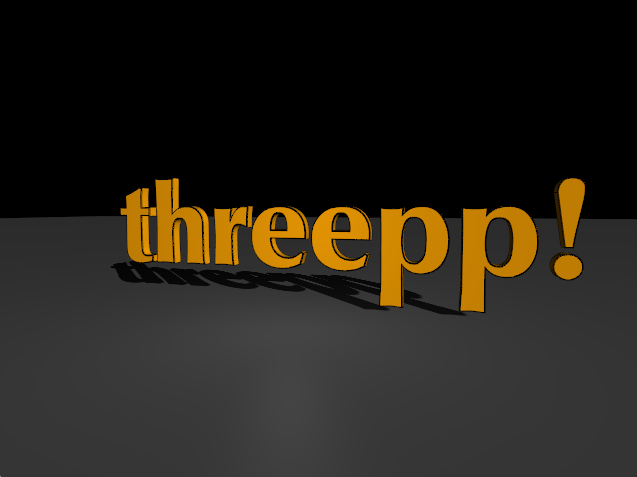
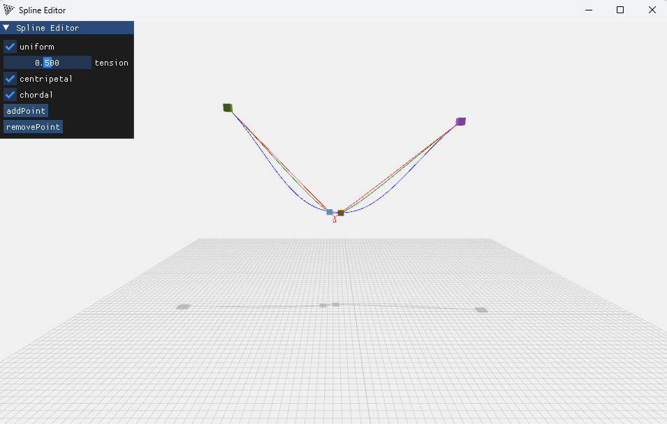
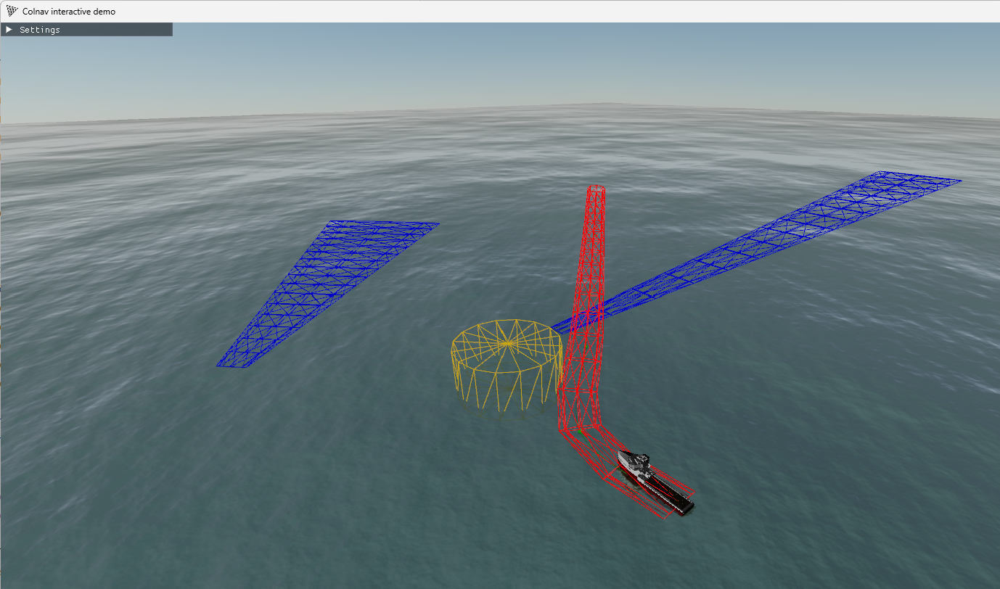
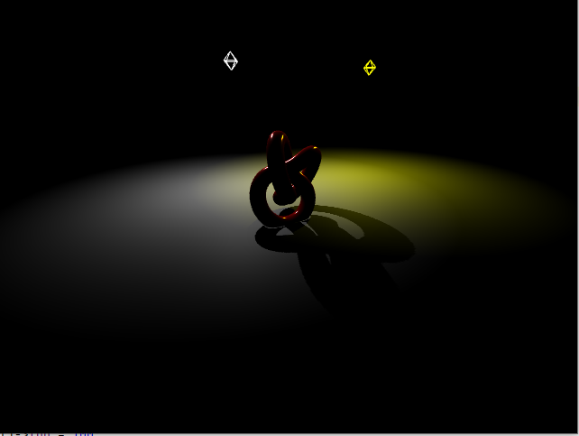
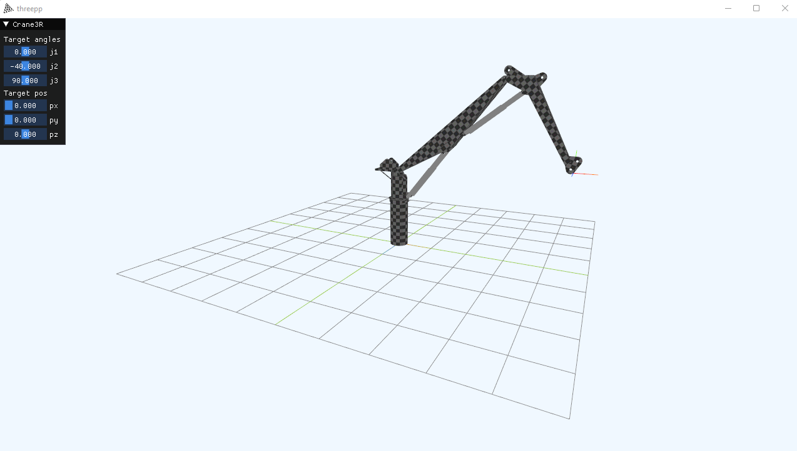

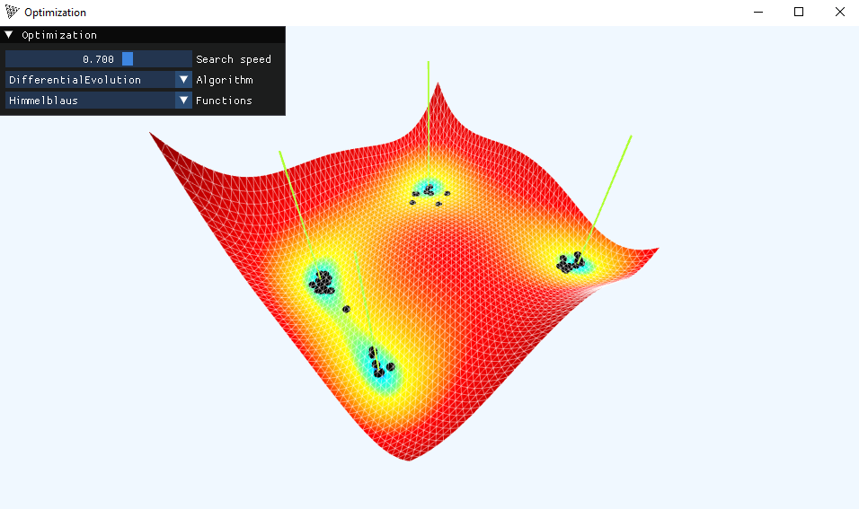
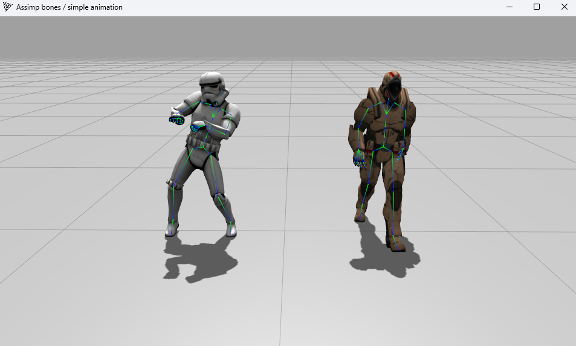
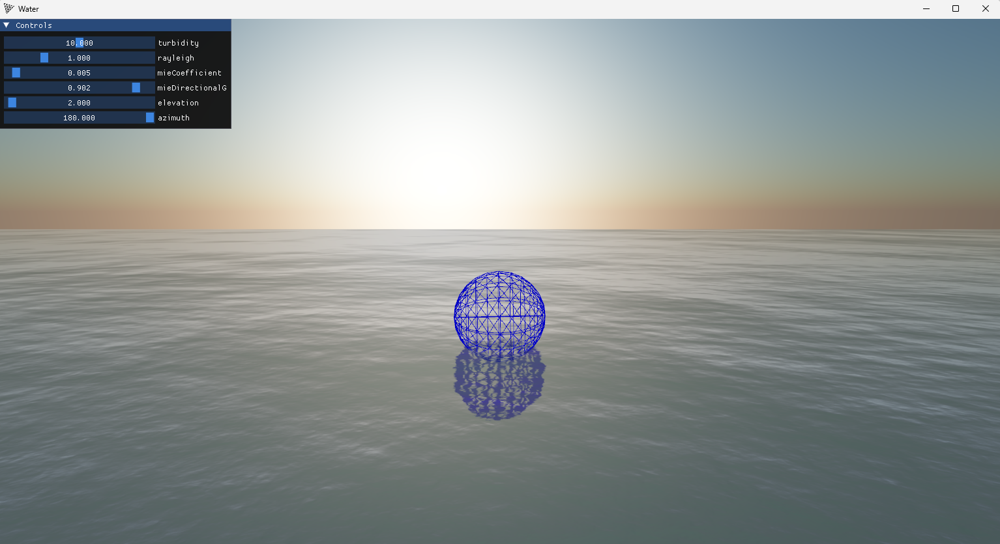
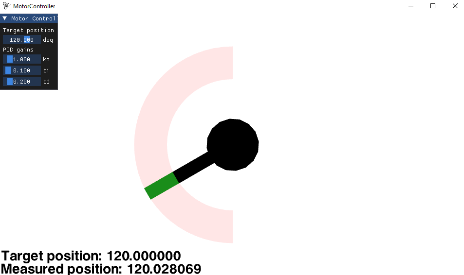
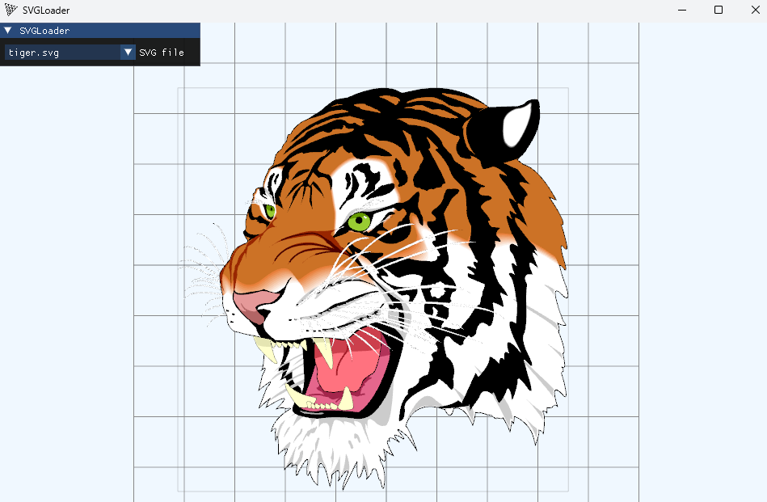
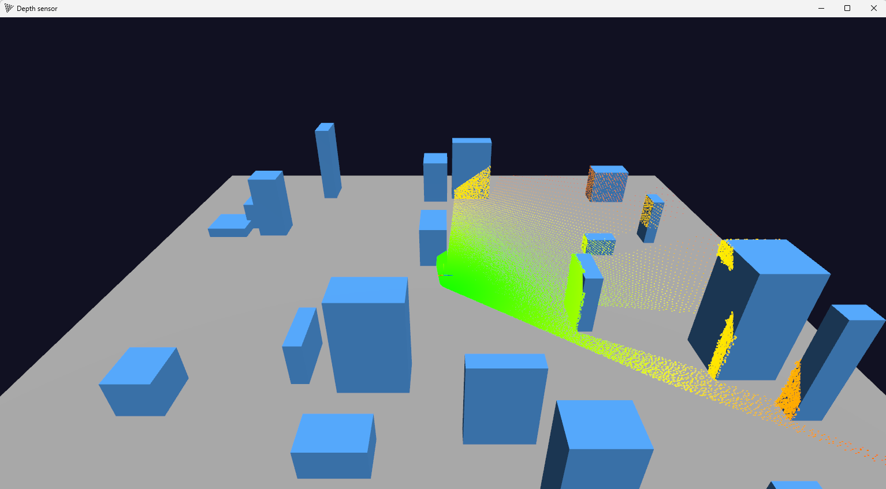
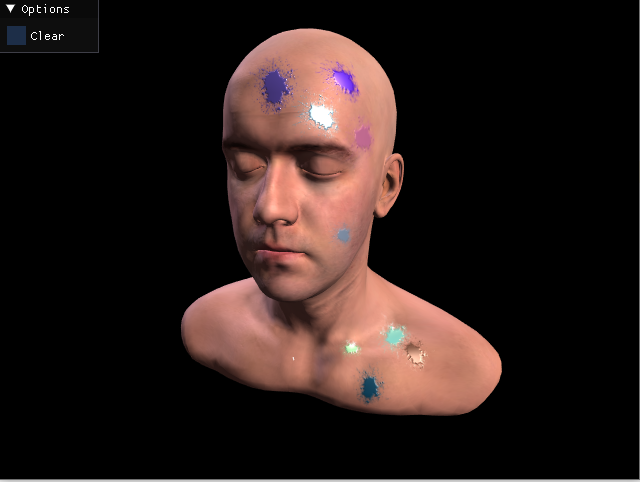
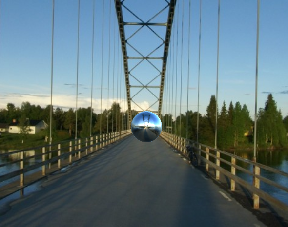
