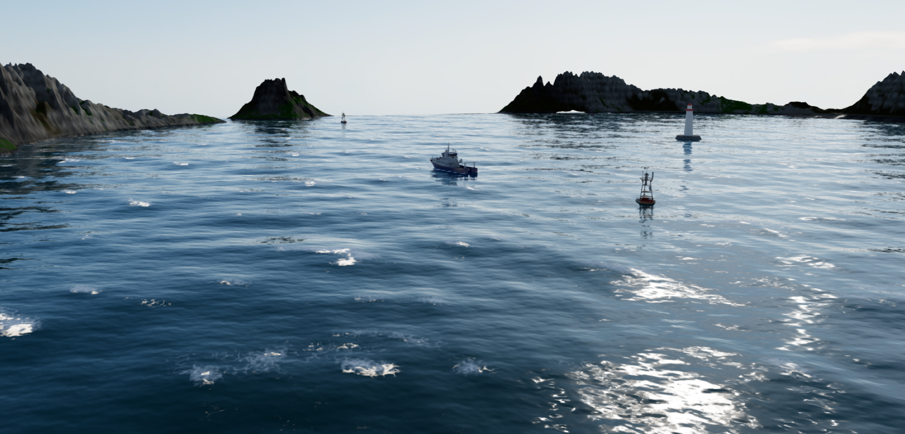
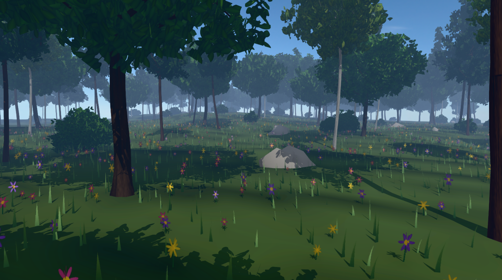
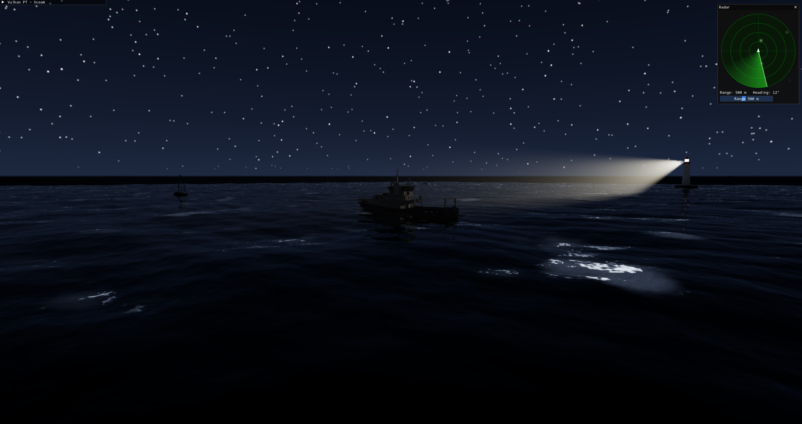
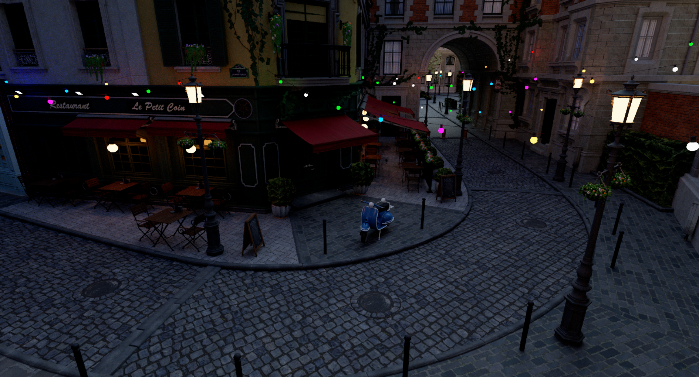
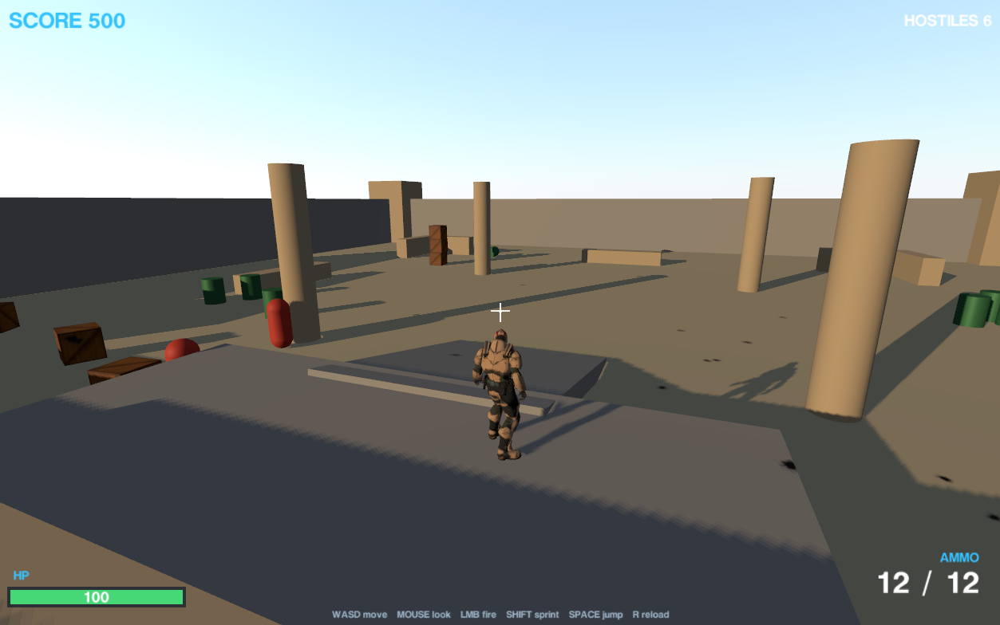
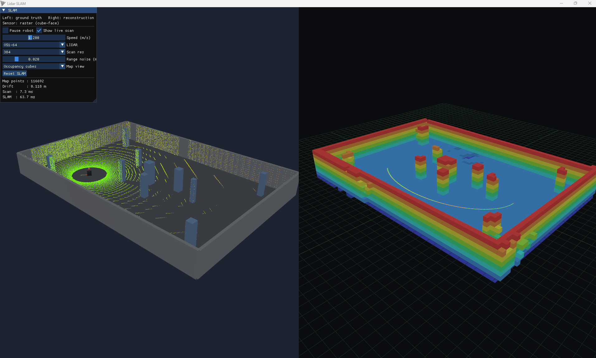
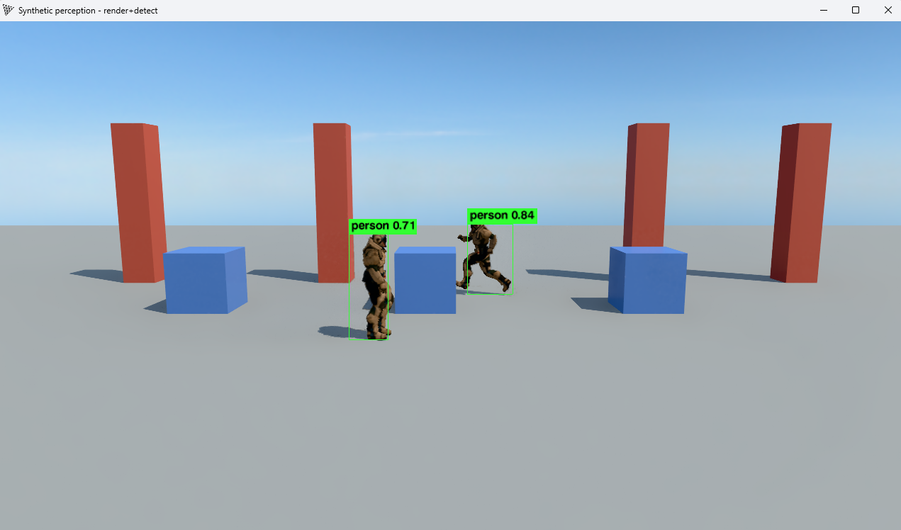
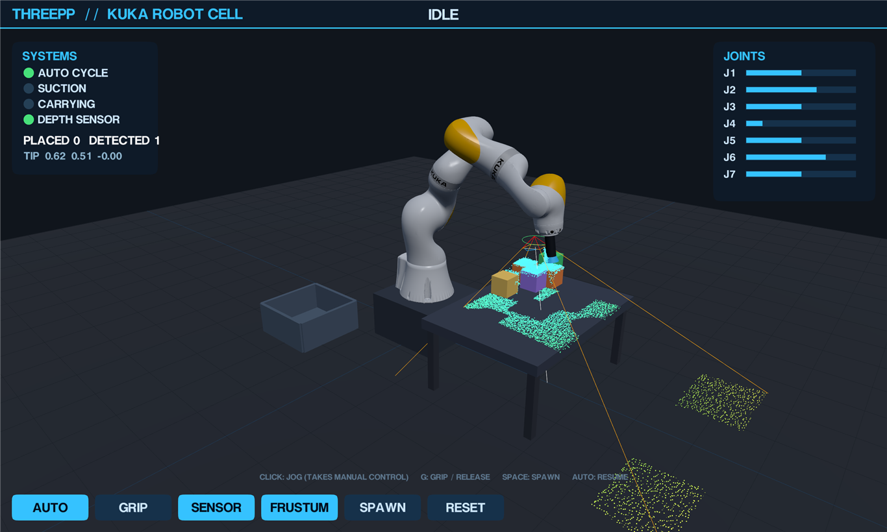
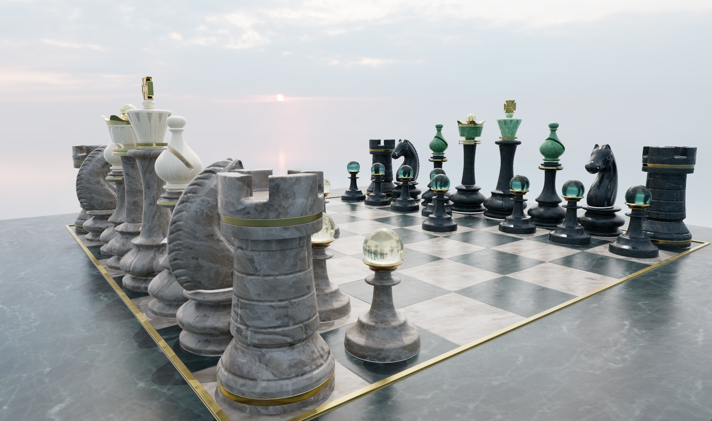

# threepp

[](https://github.com/markaren/threepp/actions/workflows/config.yml)
[](LICENSE)
[](https://conan.io/center/recipes/threepp)

A cross-platform C++20 3D library with the high-level API of [three.js](https://github.com/mrdoob/three.js/) —
and modern backends: OpenGL, WebGPU, and a real-time path-tracing Vulkan renderer.


*Real-time FFT ocean — Vulkan deferred-hybrid renderer (raster-first, with ray-traced shadows & reflections) ([examples/vulkan/vulkan_ocean.cpp](examples/vulkan/vulkan_ocean.cpp))*


*Procedural terrain, trees and vegetation ([examples/extras/vegetation/forest_demo.cpp](examples/extras/vegetation/forest_demo.cpp))*


> You get a scene graph, materials, lighting, cameras, render loop, controls, loaders, all composable, in a handful of lines.

## Highlights

* Three rendering backends behind one scene graph: OpenGL 3.3 raster, WebGPU raster,
  and a Vulkan **real-time path tracer** (ReSTIR DI/GI, denoising,
  hybrid raster-first deferred mode)
* **Python bindings** — pybind11 bindings for the core scene API; renders to NumPy arrays
* FFT-displaced ocean, water & sky shaders, PMREM environment maps
* Path-traced sensor simulation: LIDAR, depth sensor, event camera
* Built-in model loaders [Binary STL, OBJ/MTL, glTF, COLLADA, USD, FBX, SVG, URDF]
* Builds on Windows, Linux, macOS, MinGW and with Emscripten.

## Current state of the project

> **Primary use case: research and education.** `threepp` is built for research, prototyping, and
> learning — not as a production-hardened engine. **API and behavioural stability are not prioritized:**
> APIs may change, and backends (especially the path tracer) evolve rapidly. Pin a tag/commit if you
> need reproducibility, and expect to track changes if you follow `master`.

The core library is mature and feature-complete, with advanced rendering capabilities including
real-time path tracing on the Vulkan backend. It is usable for a wide variety of rendering applications,
from interactive 3D apps to robotics and scientific visualization.

The high-level API is mostly in line with three.js [r129](https://github.com/mrdoob/three.js/tree/r129)
with changes from newer revisions in some areas.
The OpenGL backend is a mechanical port of the WebGL renderer. The WebGPU renderer is mostly at feature
parity with the GL backend but is not a direct port of the three.js WebGPU renderer.

### What works?

* Line, Points, Mesh, InstancedMesh
* Geometries [Box, Sphere, Plane, Cylindrical, Capsule, Tube, ++]
* Lights [Ambient, Directional, Point, Spot, Hemi, RectArea]
* Raycasting [Mesh, Line, Points]
* 2D/3D Textures, 2D/3D text, Sprites, RenderTarget, CubeMaps
* Transparency, Transmission, Shadows
* Environment maps, including PMREM
* Animation, morph targets, Bones
* Controls [Orbit, Fly, Drag, Transform]
* Water and Sky shaders
* Built-in text rendering and font loading [typeface.json, TTF]
* Basic Audio support using [miniaudio](https://miniaud.io/docs/manual/index.html)
* Generic model loader based on [Assimp](https://github.com/assimp/assimp)
* Easy integration with [Dear ImGui](https://github.com/ocornut/imgui)

## But, but why?

Because C++ deserves nice things too.

Also, because fun.

## Implementation notes

In general, you'll find that math classes are value types, while `threepp` expects smart pointers for other types.
For convenience, geometries, materials, etc. have a static `::create` function that returns a `std::shared_ptr`.
Thus, you don't necessarily need to handle memory explicitly using `threepp`.
Furthermore, materials, geometries and textures are automatically disposed of when they go out of scope.
Yay!


### A good fit for AI-assisted development

- **Familiar API.** `threepp` mirrors the [three.js](https://github.com/mrdoob/three.js/)
  API — well-represented in model training data. This gives an
  agent context and a head start on the design rationale.
- **Few dependencies.** Small enough to build without dependency hell and reason about
  end-to-end.
- **Full access.** Almost entirely first-party source — an agent can read and modify any layer, from
  the scene graph to the path-tracer's shaders.
- **Tight write → compile → display → save → evaluate loop.** Low overhead from code to a
  rendered image and back: compile, render (headless if needed), screenshot, judge, iterate.

## Example

```cpp
#include "threepp/threepp.hpp"

using namespace threepp;

auto createBox(const Vector3& pos, const Color& color) {
    auto geometry = BoxGeometry::create();
    auto material = MeshPhongMaterial::create();
    material->color = color;
    
    auto box = Mesh::create(geometry, material);
    box->position.copy(pos);
    
    return box;
}

auto createPlane() {
    auto planeGeometry = PlaneGeometry::create(5, 5);
    auto planeMaterial = MeshLambertMaterial::create();
    planeMaterial->color = Color::gray;
    planeMaterial->side = Side::Double;
    
    auto plane = Mesh::create(planeGeometry, planeMaterial);
    plane->position.y = -1;
    plane->rotateX(math::degToRad(90));
    
    return plane;
}

int main() {

    Canvas canvas{"Demo"};
    GLRenderer renderer{canvas};

    auto scene = Scene::create();
    auto camera = PerspectiveCamera::create(75, canvas.aspect(), 0.1f, 100.f);
    camera->position.z = 5;
    
    OrbitControls controls{*camera, canvas};

    auto light = HemisphereLight::create();
    scene->add(light);

    auto plane = createPlane();
    scene->add(plane);
    
    auto group = Group::create();
    group->add(createBox({-1, 0, 0}, Color::green));
    group->add(createBox({1, 0, 0}, Color::red));
    scene->add(group);

    canvas.onWindowResize([&](WindowSize size) {
        camera->aspect = size.aspect();
        camera->updateProjectionMatrix();
        renderer.setSize(size);
    });
    
    Clock clock;
    canvas.animate([&] {
        
        const auto dt = clock.getDelta();
        group->rotation.y += 1.f * dt;

        renderer.render(*scene, *camera);
    });
}
```

Swap `GLRenderer` for `VulkanRenderer` (real-time path tracing) or `WgpuRenderer` —
the scene code stays the same.

### Python

The same scene graph is available from Python:

```python
import threepp as tp

canvas = tp.Canvas("offscreen", width=800, height=600, headless=True)
renderer = tp.GLRenderer(canvas)

scene = tp.Scene()
camera = tp.PerspectiveCamera(75, 800 / 600, 0.1, 100)
camera.position.z = 5

mat = tp.MeshStandardMaterial()
mat.color = 0x00aaff
scene.add(tp.Mesh(tp.BoxGeometry(), mat))
scene.add(tp.HemisphereLight())

renderer.render(scene, camera)
pixels = renderer.read_pixels()   # (H, W, 3) uint8 NumPy array
renderer.save_frame("out.png")
```

Build the wheel from source (OpenGL backend; Vulkan and PhysX remain opt-in CMake builds):
```shell
pip install .
```

Looking for more? The [examples](examples) folder is the de-facto documentation,
covering everything from geometries and loaders to full demo applications.

## How to build

`threepp` comes bundled with all required core dependencies.

Use CMake for project configuration and building.

Do note that you may also use a system installation of GLFW3 if you want or have issues with the bundled setup by passing
`-DTHREEPP_USE_EXTERNAL_GLFW=ON` to CMake.

### Windows

```shell
cmake . -A x64 -B build
cmake --build build --config "Release"
```

### Unix

```shell
cmake . -B build -DCMAKE_BUILD_TYPE="Release"
cmake --build build
```

### Building examples with Emscripten

Pass to CMake:
```shell
-DCMAKE_TOOLCHAIN_FILE="[path to emscripten]\emsdk\upstream\emscripten\cmake\Modules\Platform\Emscripten.cmake"
```

This will generate .html versions of a subset of the examples to be loaded in a browser. <br>
**You can run a collection of them online [here](https://laht.folk.ntnu.no/web/threepp_examples/).**

### Optional downstream dependencies

When consuming `threepp` in your own application,
some headers will require additional dependencies to compile.

| **Header**   | **Dependency** | **Description**                               |
|--------------|----------------|-----------------------------------------------|
| AssimpLoader | assimp         | Import a wide variety of different 3D formats |
| ImguiContext | imgui          | ImGUI utility                                 |
| Physx\*      | physx          | Physics simulation                            |
| Vulkan\*     | Vulkan SDK     | Vulkan renderer backend                       |

## Consuming threepp

Threepp is mainly available as a CMake package and can be consumed in a number of ways. 
It's also available as a [Conan](https://conan.io/center/recipes?value=threepp) package, 
so it can be consumed using [conan](https://conan.io/) or [xmake](https://xmake.io/).

### CMake FetchContent (recommended)

`threepp` is compatible with CMake's `FetchContent`:

```cmake
include(FetchContent)
set(THREEPP_BUILD_TESTS OFF)
set(THREEPP_BUILD_EXAMPLES OFF)
FetchContent_Declare(
        threepp
        GIT_REPOSITORY https://github.com/markaren/threepp.git
        GIT_TAG tag_or_branch   # use a tag/branch (required for GIT_SHALLOW)
        GIT_SHALLOW TRUE        # fetch only the tip to keep the download small
)
FetchContent_MakeAvailable(threepp)
#...
target_link_libraries(main PUBLIC threepp::threepp)
```

This is the preferred approach, as it enables users to update the targeted threepp version at will.

With `THREEPP_BUILD_EXAMPLES` and `THREEPP_BUILD_TESTS` off (as above), only the library is fetched. 
The example/test assets (models, textures, fonts, sounds, …) live in a separate 
[`threepp_data`](https://github.com/markaren/threepp_data) repository, fetched automatically *only* 
when examples or tests are enabled — library consumers never download them. 
For local development against a working copy of the assets, configure with 
`-DFETCHCONTENT_SOURCE_DIR_THREEPP_DATA=/path/to/threepp_data`.

> Tip: Since the threepp examples bundle _imgui_, you can link against it by including:
>```cmake
>add_subdirectory("${threepp_SOURCE_DIR}/examples/external")
>```

An example is provided [here](tests/threepp_fetchcontent_test). <br>

See also [this demo](https://github.com/markaren/threepp_wxwidgets), 
which additionally uses [WxWidgets](https://wxwidgets.org/) as the Window system.

### Using Conan

Example `conanfile.py` :

```python
from conan import ConanFile
from conan.tools.cmake import CMake, cmake_layout


class ExampleRecipe(ConanFile):
    settings = "os", "compiler", "build_type", "arch"
    generators = "CMakeDeps", "CMakeToolchain"

    def requirements(self):
        self.requires("threepp/0.0.20260310")

    def layout(self):
        cmake_layout(self)

    def build(self):
        cmake = CMake(self)
        cmake.configure()
        cmake.build()
```

### Xmake

Example `xmake.lua` file:

```lua
add_rules("mode.debug", "mode.release")
add_requires("imgui", {configs = {glfw_opengl3 = true}}) -- optional dependency for UI widgets
add_requires("assimp") -- optional dependency for importing assembly models (.glb/.dae)
add_requires("conan::threepp/0.0.20260310", {
    alias = "threepp",
    configs = {
        settings = {"compiler.cppstd=20"}
    }
})
target("example")
set_kind("binary")
add_files("src/*.cpp")
add_packages("imgui", "threepp", "assimp")
set_languages("c++20")
```

## Gallery

| | |
|:---:|:---:|
| <br>*Lighthouse at night — deferred hybrid, volumetric beam ([vulkan_ocean](examples/vulkan/vulkan_ocean.cpp))* | <br>*Lumberyard Bistro, path traced ([vulkan_bistro](examples/vulkan/vulkan_bistro.cpp))* |
| <br>*Third-person shooter ([projects/Shooter](examples/projects/Shooter))* | <br>*LIDAR* |
| <br>*RF-DETR detection* | <br>*Water and sky shaders* |
| <br>*Skinned animation* | <br>*Shadow mapping* |
| <br>*Optimization playground ([projects/Optimization](examples/projects/Optimization))* | <br>*Collision avoidance* |
| <br>*Spline editor* | <br>*SVG-based UI* |
| <br>*SVG loader* | <br>*Text rendering* |
| <br>*Fly controls* | <br>*glTF Chessboard under HDRi sky* |
