# threepp

[](https://github.com/markaren/threepp/actions/workflows/config.yml)
[](LICENSE)
[](https://conan.io/center/recipes/threepp)

A cross-platform C++20 3D library with the high-level API of [three.js](https://github.com/mrdoob/three.js/) —
and modern backends: portable OpenGL, and a deferred Vulkan renderer with ray-traced accents.

On top of that: a scene editor, PhysX-backed robot simulation, and ground-truth
sensor output for synthetic-data generation.

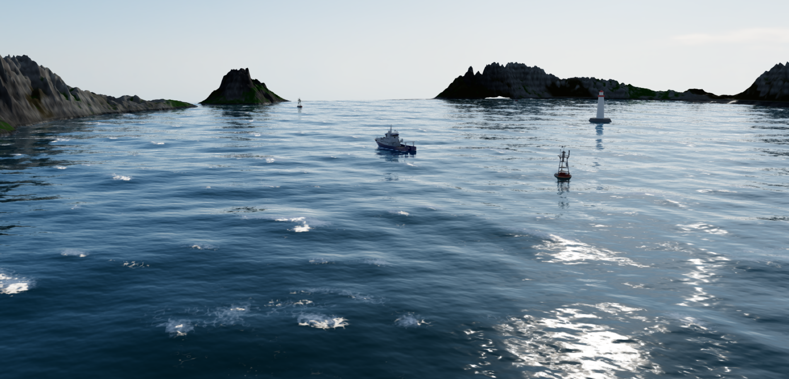
*Real-time FFT ocean — Vulkan deferred-hybrid renderer (raster-first, with ray-traced shadows & reflections) ([examples/vulkan/vulkan_ocean.cpp](examples/vulkan/vulkan_ocean.cpp))*

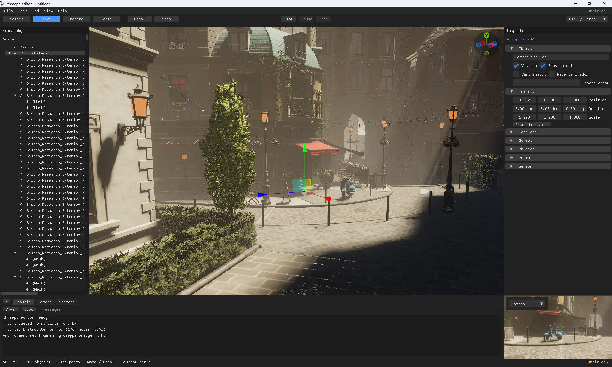
*The scene editor — hierarchy, inspector, Play mode, and a live sensor preview ([apps/editor](apps/editor), [doc/editor.md](doc/editor.md))*


> You get a scene graph, materials, lighting, cameras, render loop, controls, loaders, all composable, in a handful of lines.

📖 **New here? Start with [Getting started](doc/getting_started.md)** — a guide to the concepts
the whole library is built from: the scene graph, ownership and lifetimes, geometry/material,
lights, the frame loop, loaders and the two backends.


## Highlights

**Rendering**

* Two backends behind one scene graph: OpenGL 3.3 raster (the portable baseline,
  also the Emscripten/WebGL2 target) and a **deferred Vulkan renderer** (raster
  G-buffer with ray-traced AO, GI, reflections and shadows; denoised, with TAA).
* **`Ocean`** — three-cascade FFT-displaced water with foam, transmission and live
  wind. Vulkan only; on OpenGL the type
  is an inert flat plane. 
* PMREM environment maps.
* **Gaussian splatting** — `SplatCloud` renders scans on both backends, with two
  loaders (INRIA `.ply`, PlayCanvas SOG) and dynamic LOD on Vulkan.

**Simulation & perception**

* **Ground-truth labels straight out of the render** (Vulkan) — one call reads the
  G-buffer in its native format: float32 metric depth, per-object instance ids that
  survive add/remove/hide/LOD, semantic classes, world normals and motion. `addView`
  attaches N cameras rendered from one scene build in a single submission, so a whole
  sensor rig sees the same simulated instant.
* **Simulated sensors** — LIDAR (VLP-16/HDL-32E/OS1-64/OS0-128 patterns), depth and
  event cameras, plus IMU, joint encoder, contact and 6-axis force/torque. Ray-traced
  on Vulkan, rasterized on OpenGL, with the same range semantics on both. Every
  measurement is seeded and sim-clock-stamped, so a recorded run replays bit-for-bit.
* **Robots, not just rigid bodies** — PhysX reduced-coordinate articulations built from
  a URDF or xacro in one call, with joints, limits, PD drives, V-HACD concave colliders,
  and a header-only damped-least-squares IK solver. From C++ and Python.
* **Physical camera, lens and sensor model** — EV100 exposure from an aperture/shutter/ISO
  triplet, photometric light units, OpenCV-convention intrinsics, Brown-Conrady and fisheye
  distortion applied to both the image and the labels, and electron-domain sensor noise.
  All off by default; it expects a scene lit in real photometric units.

**Tooling**

* **A scene editor and a headless player** — author scenes with physics, sensors and
  Python behaviour scripts, then replay them in CI. Documents are plain three.js JSON,
  so an authored scene runs in an ordinary threepp program with no editor present.
* **Python bindings** — the scene graph, headless render-to-NumPy, PhysX, and
  `threepp.rl` (a GPU-vectorized RL stack).
* Built-in loaders — models [Binary STL, OBJ/MTL, glTF/GLB incl. meshopt compression,
  COLLADA, SVG, URDF/xacro], images [PNG/JPEG, DDS, WebP, Radiance HDR, OpenEXR] and
  Gaussian-splat scans. `USDLoader` and `FBXLoader` are opt-in.
* **Native xacro support** — URDF loading takes `.urdf.xacro` directly (macros, properties,
  YAML-driven parameters, `$(find)`/`$(arg)`), no ROS or Python install required; verified
  against the Franka and Universal Robots ROS 2 description.
* Builds on Windows, Linux, macOS, MinGW and with Emscripten.

## Current state of the project

> **Primary use case: research and education.** `threepp` is built for research, prototyping, and
> learning — not as a production-hardened engine. **API and behavioural stability are not prioritized:**
> APIs may change, and backends (especially the Vulkan backend) evolve rapidly. Pin a tag/commit if you
> need reproducibility, and expect to track changes if you follow `master`.

There are two layers here, and they move at very different speeds.

**The three.js port is mature and stable.** The high-level API is mostly in line with three.js
[r129](https://github.com/mrdoob/three.js/tree/r129) with changes from newer revisions in some
areas, and the OpenGL backend is a mechanical port of the WebGL renderer. It barely moves between
releases, and it is what most users touch.

**The simulation layer on top of it is where the project is going** — the deferred Vulkan renderer,
the sensor suite, PhysX robotics, the editor and the Python bindings. That is where the work goes,
and it is what the stability warning above is really about.

A few limits worth knowing before you start:

* The Vulkan backend evolves fastest and breaks most often. OpenGL is the conservative choice.
* Gaussian splat clouds are a backdrop, not a simulation asset: they cast no shadows, appear in
  no reflection, contribute nothing to GI, are invisible to the ray-traced sensors, and are not
  serialized.
* The editor is tested against OpenGL; its Vulkan view pane is best-effort. See the known-limitations
  list in [doc/editor.md](doc/editor.md).
* GPU code paths are not covered by CI — the runners have no device. Golden-image tests are a local
  pre-push check.

### What works?

**three.js parity** — what the ported API gives you:

* Line, Points, Mesh, InstancedMesh
* Geometries [Box, Sphere, Plane, Cylindrical, Capsule, Tube, ++]
* Lights [Ambient, Directional, Point, Spot, Hemi, RectArea]
* Raycasting [Mesh, Line, Points]
* 2D/3D Textures, 2D/3D text, Sprites, RenderTarget, CubeMaps
* Transparency, Transmission, Shadows
* Post-processing on the OpenGL path: `EffectComposer` with render/shader/mask/
  clear/texture/save passes plus `UnrealBloomPass` and `BokehPass` (depth of
  field), MSAA-capable internal targets, and three.js addon shaders that port
  over as-is ([examples/postprocessing](examples/postprocessing))
* Environment maps, including PMREM
* Animation, morph targets, Bones
* Controls [Orbit, Fly, Drag, Transform]
* Water and Sky shaders
* Built-in text rendering and font loading [typeface.json, TTF]
* Scene serialization — `ObjectExporter`/`ObjectLoader` read and write three.js
  "Object" JSON (metadata 4.5) deterministically, with the option to *reference*
  source models and textures instead of inlining them. Documents authored by the
  three.js editor load as-is.

**Beyond three.js** — what this library adds:

* Gaussian splatting — `SplatCloud` with two scan loaders and a Vulkan compute
  tile rasterizer ([doc/vulkan_splats.md](doc/vulkan_splats.md))
* Simulated sensors — LIDAR, depth and event cameras, IMU, joint encoder, contact,
  force/torque
* PhysX physics — rigid bodies, reduced-coordinate articulations, joints, soft
  bodies, vehicles, and V-HACD convex decomposition
* Automatic mesh LOD (Vulkan, on by default), GPU occlusion culling, and NVIDIA
  DLSS / AMD FSR 3.1 temporal upscaling
* Procedural content, all asset-free and first-party — quadtree-LOD terrain, trees,
  grass, conveyor systems, a parametric log cabin
* Real-world terrain — a documented "region pack" format plus an included Python tool
  that builds one from Norwegian national open data (Kartverket elevation, NVDB roads,
  OSM footprints with building heights)
* Basic Audio support using [miniaudio](https://miniaud.io/docs/manual/index.html)
* Generic model loader based on [Assimp](https://github.com/assimp/assimp)
  (requires the assimp package — see [Optional downstream dependencies](#optional-downstream-dependencies))
* Easy integration with [Dear ImGui](https://github.com/ocornut/imgui)

### Applications

Two binaries build alongside the library (`THREEPP_BUILD_EDITOR`, on by default for a
top-level GLFW build):

* **`threepp_editor`** — a scene editor: viewport, hierarchy, inspector, undo/redo, and a
  Play mode backed by PhysX. Scenes save as ordinary three.js Object JSON with everything
  editor-specific (physics, sensors, scripts, joints, vehicles, splines, conveyors, sound)
  in `userData`, so a saved document opens and runs in a plain threepp program with no
  editor present. Python behaviour scripts attach to objects Unity-style.
  See [doc/editor.md](doc/editor.md).
* **`threepp_player`** — the same play runtime with no editing machinery: headless,
  independent episodes, sensor CSV recording, and a nonzero exit if any script raised or
  the document would not play. It registers the same play sessions the editor does, in the
  same order, so a scene that runs under Play runs in CI. See [doc/player.md](doc/player.md).

## But, but why?

Because C++ deserves nice things too.

Also, because fun.

## Implementation notes

In general, you'll find that math classes are value types, while `threepp` expects smart pointers for other types.
For convenience, geometries, materials, etc. have a static `::create` function that returns a `std::shared_ptr`.
Thus, you don't necessarily need to handle memory explicitly using `threepp`.
Furthermore, materials, geometries and textures are automatically disposed of when they go out of scope.
Yay!

`threepp/threepp.hpp` is a convenience umbrella over the three.js-equivalent core. Everything under
`extras/`, `postprocessing/`, `splats/` and the newer objects and loaders is included explicitly —
if a feature listed above seems missing, check its own header first.


### A good fit for AI-assisted development

- **Familiar API.** `threepp` mirrors the [three.js](https://github.com/mrdoob/three.js/)
  API — well-represented in model training data. This gives an
  agent context and a head start on the design rationale.
- **Few dependencies.** Small enough to build without dependency hell and reason about
  end-to-end.
- **Full access.** Almost entirely first-party source — an agent can read and modify any layer, from
  the scene graph to the Vulkan renderer's shaders.
- **Tight write → compile → display → save → evaluate loop.** Low overhead from code to a
  rendered image and back: compile, render (headless if needed), screenshot, judge, iterate.

## Example

```cpp
#include "threepp/threepp.hpp"

using namespace threepp;

auto createBox(const Vector3& pos, const Color& color) {
    auto geometry = BoxGeometry::create();
    auto material = MeshPhongMaterial::create();
    material->color = color;
    
    auto box = Mesh::create(geometry, material);
    box->position.copy(pos);
    
    return box;
}

auto createPlane() {
    auto planeGeometry = PlaneGeometry::create(5, 5);
    auto planeMaterial = MeshLambertMaterial::create();
    planeMaterial->color = Color::gray;
    planeMaterial->side = Side::Double;
    
    auto plane = Mesh::create(planeGeometry, planeMaterial);
    plane->position.y = -1;
    plane->rotateX(math::degToRad(90));
    
    return plane;
}

int main() {

    Canvas canvas{"Demo"};
    GLRenderer renderer{canvas};

    auto scene = Scene::create();
    auto camera = PerspectiveCamera::create(75, canvas.aspect(), 0.1f, 100.f);
    camera->position.z = 5;
    
    OrbitControls controls{*camera, canvas};

    auto light = HemisphereLight::create();
    scene->add(light);

    auto plane = createPlane();
    scene->add(plane);
    
    auto group = Group::create();
    group->add(createBox({-1, 0, 0}, Color::green));
    group->add(createBox({1, 0, 0}, Color::red));
    scene->add(group);

    canvas.onWindowResize([&](WindowSize size) {
        camera->aspect = size.aspect();
        camera->updateProjectionMatrix();
        renderer.setSize(size);
    });
    
    Clock clock;
    canvas.animate([&] {
        
        const auto dt = clock.getDelta();
        group->rotation.y += 1.f * dt;

        renderer.render(*scene, *camera);
    });
}
```

Swap `GLRenderer` for `VulkanRenderer` (deferred, ray-traced accents) — the scene
code stays the same.

### Python

The same scene graph is available from Python:

```python
import threepp as tp

canvas = tp.Canvas("offscreen", width=800, height=600, headless=True)
renderer = tp.GLRenderer(canvas)

scene = tp.Scene()
camera = tp.PerspectiveCamera(75, 800 / 600, 0.1, 100)
camera.position.z = 5

mat = tp.MeshStandardMaterial()
mat.color = 0x00aaff
scene.add(tp.Mesh(tp.BoxGeometry(), mat))
scene.add(tp.HemisphereLight())

renderer.render(scene, camera)
pixels = renderer.read_pixels()   # (H, W, 3) uint8 NumPy array
renderer.save_frame("out.png")
```

Beyond the scene graph, the module exposes the Vulkan AOVs as typed NumPy arrays (metric depth,
instance and semantic ids, normals, motion), PhysX articulations, and `threepp.rl` — a
GPU-vectorized RL stack (`GpuSim`, `VecTask`, `PPO`) with no rl_games / rsl_rl / Gym dependency,
reading and writing PhysX state directly as CUDA tensors. Probe what a given build has with
`tp.HAS_VULKAN` / `tp.HAS_PHYSX` / `tp.HAS_IMGUI` / `tp.HAS_AUDIO`.

Build the wheel from source (OpenGL backend; Vulkan and PhysX remain opt-in CMake builds):
```shell
pip install .
```

Looking for more? [doc/getting_started.md](doc/getting_started.md) walks through the concepts
behind the API, and the [examples](examples) folder is the de-facto documentation,
covering everything from geometries and loaders to full demo applications.

## How to build

`threepp` comes bundled with all required core dependencies. Use CMake for project
configuration and building.

The project ships a `CMakePresets.json` holding the configurations that are actually
built and tested in CI, so you don't have to assemble a flag list yourself:

```shell
cmake --list-presets
```

| Preset       | What you get                                                          |
|--------------|-----------------------------------------------------------------------|
| `gl`         | OpenGL 3.3 backend, with examples, tests and the editor — start here  |
| `gl-debug`   | as `gl`, unoptimised and with debug info                              |
| `vulkan`     | the deferred Vulkan renderer (Vulkan SDK on PATH, or the vcpkg `vulkan` feature) |
| `vulkan-aaa` | as `vulkan`, plus the FSR 3.1 and DLSS upscalers (Windows)            |
| `python`     | the pybind11 `threepp` module                                         |
| `no-glfw`    | build check only: no GLFW frontend, and so no rendering at all        |
| `wasm`       | Emscripten/WebGL2 examples (needs an activated emsdk)                 |

```shell
cmake --preset gl
cmake --build --preset gl
ctest --preset gl
```

Each preset builds into `build/<preset-name>`, so configurations don't clobber each other.
The presets above deliberately leave the generator unset, so each platform uses its default.

Local configurations of your own belong in `CMakeUserPresets.json`, which is untracked and
whose presets can `inherit` from the ones above — this is where machine-specific paths and
personal preferences go. To build with Ninja, for instance (CI does, but it needs `cl.exe`
on `PATH` on Windows, so it is not the default here):

```json
{
  "version": 3,
  "configurePresets": [
    { "name": "my-gl", "inherits": "gl", "generator": "Ninja" }
  ]
}
```

### Configuring by hand

Presets are a convenience, not a requirement — and they don't apply when you consume
`threepp` from another project via `FetchContent`/`add_subdirectory`. Everything a preset
sets is an ordinary CMake option, so the classic invocation still works:

```shell
# Windows
cmake . -A x64 -B build
cmake --build build --config "Release"
```

```shell
# Unix
cmake . -B build -DCMAKE_BUILD_TYPE="Release"
cmake --build build
```

On a single-config generator (Ninja, Makefiles), a top-level build with no `CMAKE_BUILD_TYPE`
given defaults to `Release` rather than to a build with no optimisation flags at all — so the
flag above is explicit rather than required. Visual Studio picks the configuration at build
time instead (`--config`), and on Windows MSVC supplies its own default. Consumed as a
subproject, `threepp` leaves the build type entirely to the parent project.

Do note that you may also use a system installation of GLFW3 if you want or have issues with the bundled setup by passing
`-DTHREEPP_USE_EXTERNAL_GLFW=ON` to CMake.

### Building examples with Emscripten

With an activated emsdk (`EMSDK` set in your environment), `cmake --preset wasm` does this
for you. By hand, pass to CMake:
```shell
-DCMAKE_TOOLCHAIN_FILE="[path to emscripten]\emsdk\upstream\emscripten\cmake\Modules\Platform\Emscripten.cmake"
```

This will generate .html versions of a subset of the examples to be loaded in a browser. <br>
**You can run a collection of them online [here](https://markaren.github.io/threepp/).**

### Optional downstream dependencies

When consuming `threepp` in your own application,
some headers will require additional dependencies to compile.

| **Header**              | **Dependency** | **Description**                                        |
|-------------------------|----------------|--------------------------------------------------------|
| AssimpLoader            | assimp         | Import a wide variety of different 3D formats          |
| ImguiContext            | imgui          | ImGUI utility                                          |
| Physx\*                 | physx          | Physics simulation                                     |
| ConvexDecomposition     | v-hacd         | Concave collision shapes (pulled by the vcpkg `physx` feature) |
| Vulkan\*, Ocean, DisplacedMesh | Vulkan SDK | Vulkan renderer backend; `Ocean` links only under `THREEPP_WITH_VULKAN` |


## Consuming threepp

Threepp is mainly a CMake package. `FetchContent` is the recommended route and the one the
project tests; [conan](https://conan.io/) and [xmake](https://xmake.io/) are also possible —
see [doc/package_managers.md](doc/package_managers.md).

### CMake FetchContent (recommended)

`threepp` is compatible with CMake's `FetchContent`:

```cmake
include(FetchContent)
FetchContent_Declare(
        threepp
        GIT_REPOSITORY https://github.com/markaren/threepp.git
        GIT_TAG tag_or_branch   # use a tag/branch (required for GIT_SHALLOW)
        GIT_SHALLOW TRUE        # fetch only the tip to keep the download small
)
FetchContent_MakeAvailable(threepp)
#...
target_link_libraries(main PUBLIC threepp::threepp)
```

This is the preferred approach, as it enables users to update the targeted threepp version at will.

`THREEPP_BUILD_EXAMPLES` and `THREEPP_BUILD_TESTS` default to ON only when threepp is the 
top-level project, so consuming it via `FetchContent` (or `add_subdirectory`) builds just the 
library — set either to `ON` explicitly if you do want them. 
The example/test assets (models, textures, fonts, sounds, …) live in a separate 
[`threepp_data`](https://github.com/markaren/threepp_data) repository, fetched automatically *only* 
when examples or tests are enabled — library consumers never download them. 
For local development against a working copy of the assets, configure with 
`-DFETCHCONTENT_SOURCE_DIR_THREEPP_DATA=/path/to/threepp_data`.

> Tip: Since the threepp examples bundle _imgui_, you can link against it by including:
>```cmake
>add_subdirectory("${threepp_SOURCE_DIR}/examples/external")
>```

An example is provided [here](tests/threepp_fetchcontent_test). <br>

See also [this demo](https://github.com/markaren/threepp_wxwidgets), 
which additionally uses [WxWidgets](https://wxwidgets.org/) as the Window system.

### Conan and xmake

`threepp` is also on [Conan Center](https://conan.io/center/recipes/threepp), which xmake can
consume too. Both are covered in **[doc/package_managers.md](doc/package_managers.md)** —
including the caveat that the published recipe normally trails this repository's tags, and
that the package does not carry the Vulkan, PhysX, Python or application halves.

## Gallery

| |                                                                                                                                               |
|:---:|:---------------------------------------------------------------------------------------------------------------------------------------------:|
| 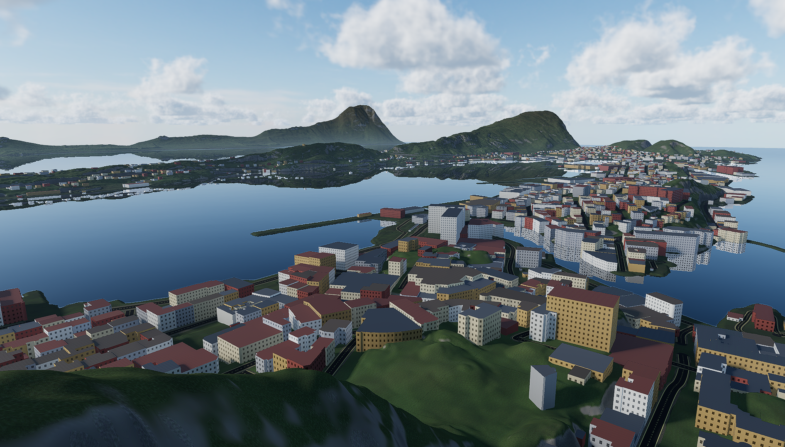<br>*Ålesund from Kartverket elevation data, NVDB roads and OSM footprints ([norway_terrain](examples/extras/terrain/norway_terrain.cpp))* |            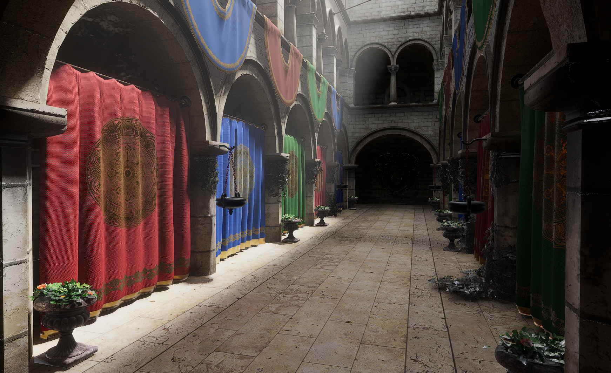<br>*Sponza — probe GI, sky light through the openings*             |
| 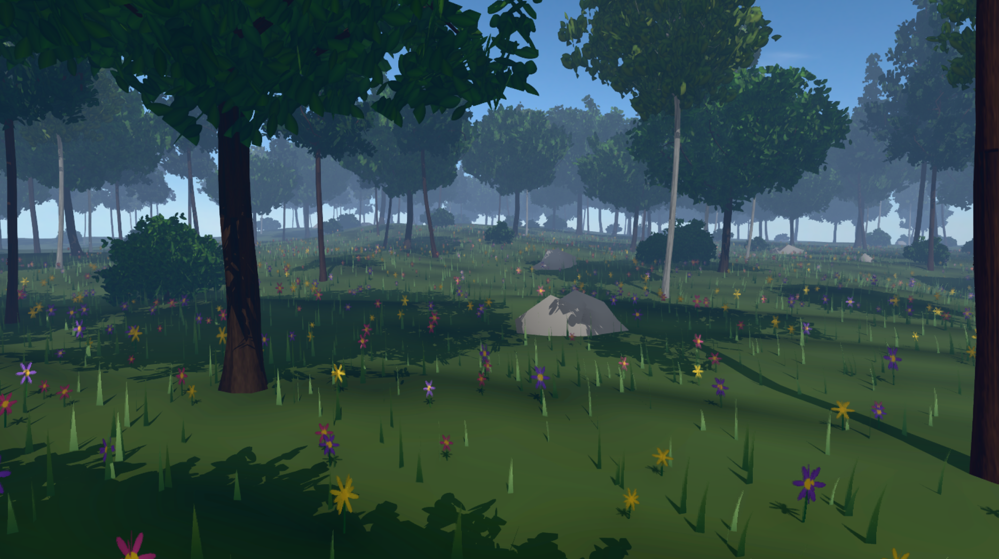<br>*Procedural terrain, trees and vegetation ([forest_demo](examples/extras/vegetation/forest_demo.cpp))* | 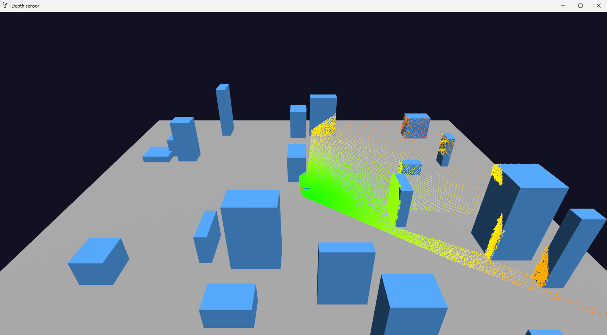<br>*Depth-camera returns, range-coloured, with occlusion shadows* |
|  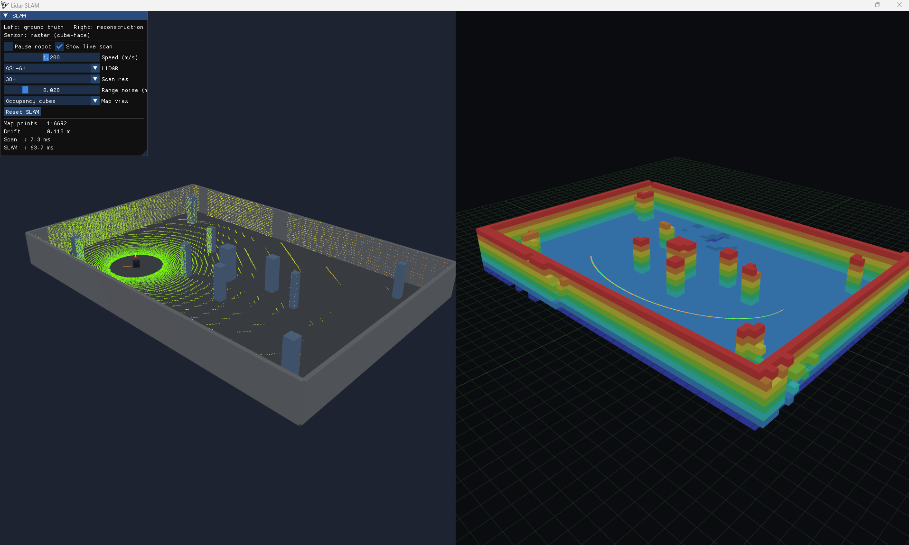<br>*LIDAR*    |                                                                       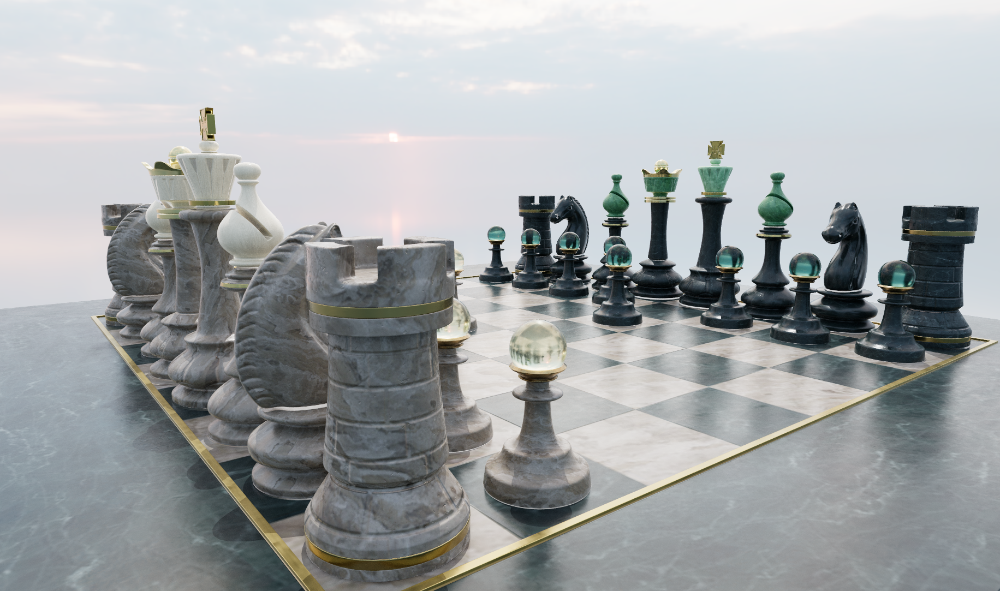<br>*glTF Chessboard under HDRi sky*                                                                         |
| 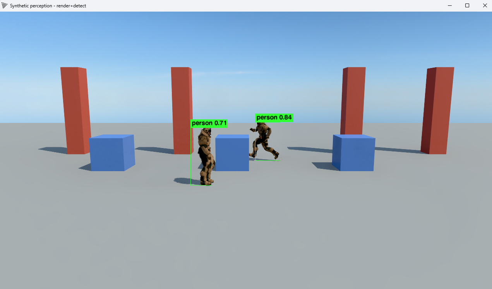<br>*RF-DETR detection* |          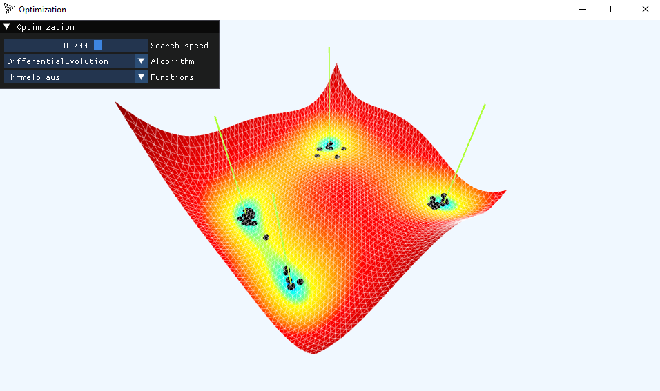<br>*Optimization playground ([projects/Optimization](examples/projects/Optimization))*                                |
| 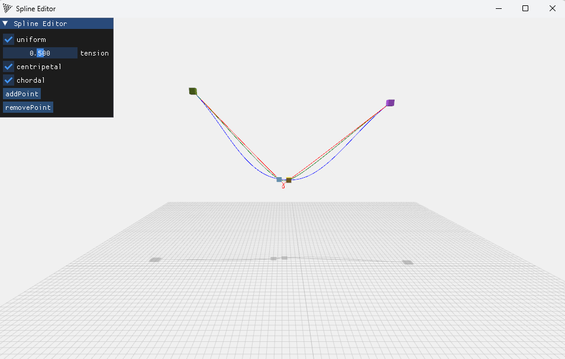<br>*Spline editor* |                         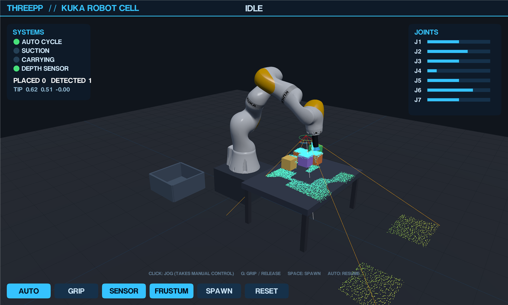<br>*SVG-based UI*                         |
| 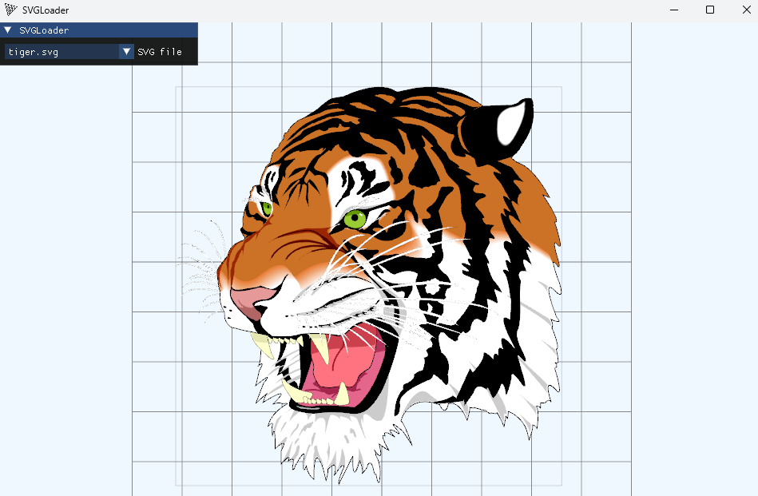<br>*SVG loader* |                               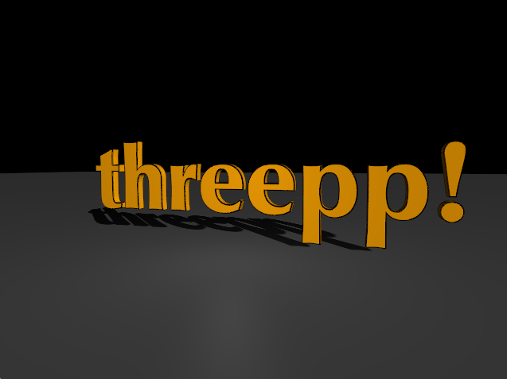<br>*Text rendering*                               |


## License

threepp is [MIT-licensed](LICENSE). It ports the API and shaders of
[three.js](https://github.com/mrdoob/three.js) (MIT) and bundles or fetches a number of
third-party libraries and assets — see [THIRD_PARTY.md](THIRD_PARTY.md) for the complete
index, including the components that are *not* MIT (the optional NVIDIA DLSS SDK, and the
Boston Dynamics Spot model in `threepp_data`).
