# threepp

[](https://github.com/markaren/threepp/actions/workflows/config.yml)
[](LICENSE)
[](https://conan.io/center/recipes/threepp)
[](https://pypi.org/project/threepp/)

A cross-platform C++20 3D library with the high-level API of [three.js](https://github.com/mrdoob/three.js/),
and two backends behind one scene graph: portable OpenGL, and a deferred Vulkan renderer with
ray-traced shadows, reflections, AO and GI.

On top of that: a scene editor, PhysX robot simulation, simulated sensors with ground-truth labels
for synthetic data, hardware-in-the-loop flight with ArduPilot, and Python bindings on PyPI.

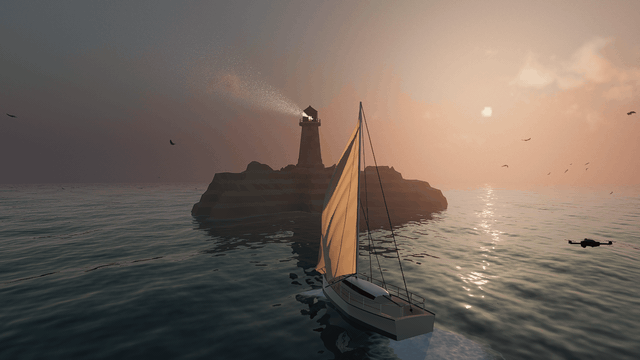<br>
*Golden hour, live: NVIDIA Warp cloth sails drive the hull on a JONSWAP FFT sea, rendered by the
Vulkan backend ([warp_sailboat.py](python/examples/warp_sailboat.py))*

**New here?** [Getting started](doc/getting_started.md) walks through the concepts the library is
built from: the scene graph, ownership and lifetimes, geometry and materials, lights, the frame
loop, loaders and the two backends. The [examples](examples) folder is the de-facto reference.

## Features

**three.js parity.** The API follows three.js [r129](https://github.com/mrdoob/three.js/tree/r129),
with selected features from r186 on the OpenGL path (shadow filtering, environment and background
controls, material fixes, the newer post-processing passes).

* Mesh, InstancedMesh, Line, Points, Sprites, 2D/3D text (typeface.json and TTF)
* The usual geometries, lights (including RectArea), cameras, raycasting, animation, morph targets and bones
* Physical materials with transmission, alpha hash and alpha-to-coverage; PMREM environment maps and `RoomEnvironment`
* Shadows, Water and Sky shaders, and Orbit, Trackball, Fly, Drag and Transform controls
* `EffectComposer` with bloom, depth of field, GTAO, outline, FXAA and output passes
* Loaders: glTF/GLB (with meshopt), OBJ/MTL, STL, COLLADA, SVG, URDF/xacro (no ROS needed), PNG/JPEG, DDS, WebP, HDR and EXR; opt-in USD, FBX and [Assimp](https://github.com/assimp/assimp)
* Scene serialization as three.js Object JSON or a single-file `.tpz` archive; three.js editor documents load as-is

**Rendering beyond three.js**

* A deferred Vulkan renderer: raster G-buffer, ray-traced shadows, reflections, AO and probe GI,
  volumetric fog, denoising and TAA, DLSS and FSR 3.1 upscaling, automatic mesh LOD and GPU occlusion culling
* `Ocean` (Vulkan): three-cascade FFT water with foam, wind, JONSWAP fetch and an underwater view
* `ParticleField` (Vulkan): GPU particles for fire, smoke, snow, rain and physics-coupled grains,
  drawn as meshes or billboards, or marched as participating media
* Gaussian splatting: `SplatCloud` renders `.ply` and SOG scans on both backends, and a scan can be
  baked into a triangle surface for physics and sensors ([doc/vulkan_splats.md](doc/vulkan_splats.md))

**Simulation and perception**

* Ground-truth labels from the G-buffer (Vulkan): metric depth, stable instance ids, semantic
  classes, normals and motion; `addView` renders a whole camera rig from one scene build
* Simulated sensors: lidar (VLP-16, HDL-32E, OS1-64, OS0-128 patterns), imaging sonar (Vulkan),
  depth, colour and event cameras, IMU, joint encoders, contact and force/torque. Seeded and
  sim-clock stamped: drive `setSimTime` from the same clock and a frame replays bit for bit
* A physical camera: exposure from aperture, shutter and ISO, OpenCV intrinsics, lens distortion
  applied to both image and labels, and sensor noise
* PhysX: rigid bodies, articulations built from URDF/xacro with PD drives, tendons and cables, soft
  bodies, GPU particles, vehicles, character controllers and V-HACD convex decomposition, plus a
  damped-least-squares IK solver
* Soft and granular ground from Python on NVIDIA Warp: Bekker-Wong mud and snow, and MLS-MPM grains
  that carry a wheel, checked against terramechanics data
* Hardware-in-the-loop: an unmodified ArduPilot flies a threepp airframe in lock-step
  ([doc/ardupilot_sitl.md](doc/ardupilot_sitl.md))
* Zero-copy CUDA interop: an external producer such as NVIDIA Warp writes vertex buffers in place,
  and rendered frames come back as CUDA tensors

**Content and tooling**

* Procedural terrain, trees, grass, roads, conveyors, bird flocks and a log cabin; real-world
  terrain built from Norwegian open data (`terrain::GeoScene`)
* Audio via [miniaudio](https://miniaud.io/docs/manual/index.html), with ray-traced occlusion and reverb (`AcousticScene`)
* [Dear ImGui](https://github.com/ocornut/imgui) integration
* Builds on Windows, Linux, macOS, MinGW and with Emscripten

## Applications

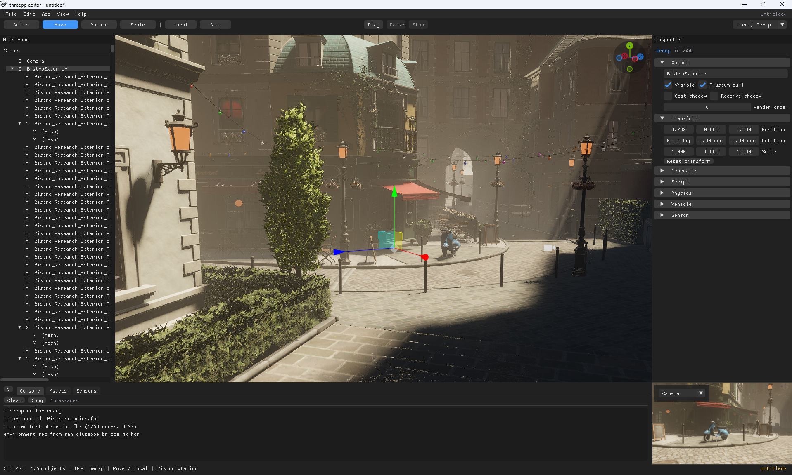

* **`threepp_editor`**: viewport, hierarchy, inspector, undo/redo and a PhysX-backed Play mode, with
  Python behaviour scripts. Scenes save as plain three.js JSON with the editor's data in `userData`,
  so they also run in an ordinary threepp program. Prebuilt for Windows: `pip install threepp-editor`.
  See [doc/editor.md](doc/editor.md).
* **`threepp_player`**: the same play runtime, headless, for CI and batch episodes. See [doc/player.md](doc/player.md).

Both build alongside the library in a top-level build (`THREEPP_BUILD_EDITOR`).

## Project status

threepp is built for research, prototyping and teaching, not as a production engine. APIs change,
so pin a tag or commit if you need reproducibility.

The three.js port is the mature layer, and the one most users touch. The simulation layer on top
(the Vulkan renderer, sensors, PhysX, the editor and Python) is where development goes, and it
moves fastest. Limits worth knowing:

* The Vulkan backend needs the Vulkan ray-tracing extensions (in practice an RT-capable GPU), so it
  does not run on macOS, where MoltenVK has none. Use `GLRenderer` there; it is also the
  conservative choice elsewhere.
* Gaussian splats cast no shadows and are invisible to the ray-traced sensors unless baked into a surface.
* The editor is tested on OpenGL; its Vulkan viewport is best-effort.
* CI has no GPU. The Vulkan backend runs there on lavapipe under the validation layers, which gates
  spec correctness, not pixels.

## Example

```cpp
#include "threepp/threepp.hpp"

using namespace threepp;

int main() {

    Canvas canvas{"Demo"};
    GLRenderer renderer{canvas};

    auto scene = Scene::create();
    auto camera = PerspectiveCamera::create(75, canvas.aspect(), 0.1f, 100.f);
    camera->position.z = 5;

    OrbitControls controls{*camera, canvas};

    scene->add(HemisphereLight::create());

    auto material = MeshPhongMaterial::create();
    material->color = Color::green;
    auto box = Mesh::create(BoxGeometry::create(), material);
    scene->add(box);

    canvas.onWindowResize([&](WindowSize size) {
        camera->aspect = size.aspect();
        camera->updateProjectionMatrix();
        renderer.setSize(size);
    });

    Clock clock;
    canvas.animate([&] {
        box->rotation.y += 1.f * clock.getDelta();
        renderer.render(*scene, *camera);
    });
}
```

Swap `GLRenderer` for `VulkanRenderer` and the scene code stays the same. Math classes are value
types; everything else is created through a static `::create` that returns a `std::shared_ptr`,
and GPU resources are released when the last reference goes. `threepp/threepp.hpp` covers the
three.js core; `extras/`, `postprocessing/`, `splats/` and the newer objects are included explicitly.

## Python

```shell
pip install threepp
```

Wheels for CPython 3.10 to 3.14 on Windows x64 and manylinux x86_64 carry the OpenGL and Vulkan
renderers and CPU PhysX. macOS builds from source (OpenGL only). Releases are named by date; pin
the one you tested.

```python
import threepp as tp

canvas = tp.Canvas("offscreen", width=800, height=600, headless=True)
renderer = tp.GLRenderer(canvas)

scene = tp.Scene()
camera = tp.PerspectiveCamera(75, 800 / 600, 0.1, 100)
camera.position.z = 5

mat = tp.MeshStandardMaterial()
mat.color = 0x00aaff
scene.add(tp.Mesh(tp.BoxGeometry(), mat))
scene.add(tp.HemisphereLight())

renderer.render(scene, camera)
pixels = renderer.read_pixels()   # (H, W, 3) uint8 NumPy array
renderer.save_frame("out.png")
```

The module also exposes the Vulkan labels as NumPy arrays, PhysX articulations, CUDA interop and
`threepp.rl`, a GPU-vectorized PPO stack. A headless canvas needs no display, so the same code runs
on Colab and cloud GPUs. [python/README.md](python/README.md) is the full guide, with the extras
(`threepp[rl]`, `threepp[editor]`) and the [Python examples](python/examples).

## Building

All core dependencies are bundled. `CMakePresets.json` holds the configurations CI builds:

| Preset       | What you get                                                                     |
|--------------|----------------------------------------------------------------------------------|
| `gl`         | OpenGL backend, with examples, tests and the editor (start here)                 |
| `gl-debug`   | as `gl`, unoptimised and with debug info                                         |
| `vulkan`     | the deferred Vulkan renderer (Vulkan SDK on PATH, or the vcpkg `vulkan` feature) |
| `vulkan-aaa` | as `vulkan`, plus the FSR 3.1 and DLSS upscalers (Windows)                       |
| `python`     | the pybind11 `threepp` module                                                    |
| `no-glfw`    | build check only: no GLFW frontend, so no rendering                              |
| `wasm`       | Emscripten/WebGL2 examples (needs an activated emsdk)                            |

```shell
cmake --preset gl
cmake --build --preset gl
ctest --preset gl
```

Each preset builds into `build/<preset>`. `cmake --list-presets` also lists the `ci-*` presets the
GitHub workflow runs, and machine-specific presets belong in an untracked `CMakeUserPresets.json`
that inherits from these. Without presets, `cmake -B build` and `cmake --build build` work as
usual; add `-DTHREEPP_USE_EXTERNAL_GLFW=ON` to use a system GLFW.

A subset of the examples runs in the browser: **[try them online](https://markaren.github.io/threepp/)**.

Some headers need extra packages when you consume them:

| Header                                                  | Dependency | Notes                                          |
|---------------------------------------------------------|------------|------------------------------------------------|
| AssimpLoader                                            | assimp     | Import a wide range of 3D formats              |
| ImguiContext                                            | imgui      | Dear ImGui utility                             |
| Physx\*, ConvexDecomposition                            | physx, v-hacd | Physics simulation and concave colliders    |
| Vulkan\*, Ocean, ParticleField, SonarSensor, and others | Vulkan SDK | Linked only under `THREEPP_WITH_VULKAN`, which the `threepp` target propagates |

## Using threepp in your project

CMake `FetchContent` is the recommended and tested route:

```cmake
include(FetchContent)
FetchContent_Declare(
        threepp
        GIT_REPOSITORY https://github.com/markaren/threepp.git
        GIT_TAG tag_or_branch
        GIT_SHALLOW TRUE
)
FetchContent_MakeAvailable(threepp)
target_link_libraries(main PUBLIC threepp::threepp)
```

Consumed this way only the library builds, and the example assets in
[threepp_data](https://github.com/markaren/threepp_data) are never downloaded. A complete setup is in
[tests/threepp_fetchcontent_test](tests/threepp_fetchcontent_test), and
[threepp_wxwidgets](https://github.com/markaren/threepp_wxwidgets) embeds threepp in a wxWidgets window.
threepp is also on [Conan Center](https://conan.io/center/recipes/threepp), which xmake can consume
too; see [doc/package_managers.md](doc/package_managers.md) for both and their caveats.

## Why?

Because C++ deserves nice things too. Also, because fun.

It also turns out to suit AI-assisted development: a three.js API that models already know, few
dependencies, first-party source all the way down to the Vulkan shaders, and a short loop from code
to a rendered image that can be captured headless and judged.

## Gallery

<table>
<tr>
<td align="center" colspan="2">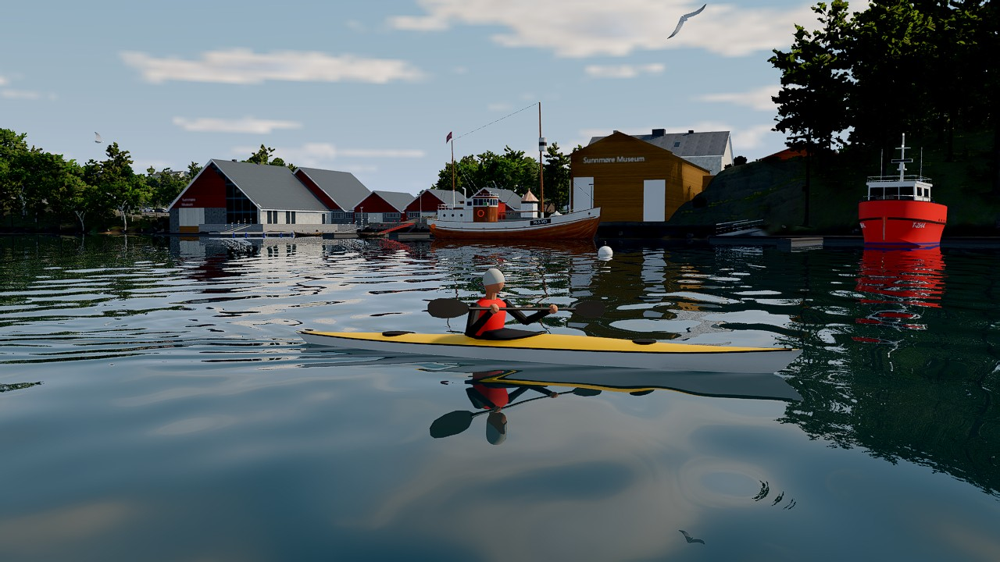<br><em>Vulkan: a sea kayak under way in a digital twin of a real waterfront in Ålesund, Norway, modelled from Kartverket lidar and sea charts (the scene is not in the repository)</em></td>
</tr>
<tr>
<td align="center" colspan="2">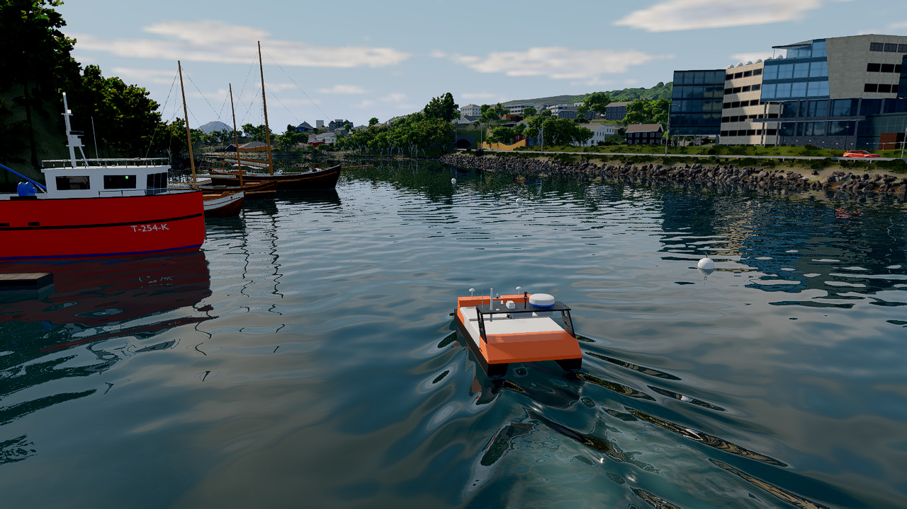<br><em>Vulkan: an Otter X sea drone under way in the same twin, the water reflecting the moored boats and the buildings ashore</em></td>
</tr>
<tr>
<td align="center">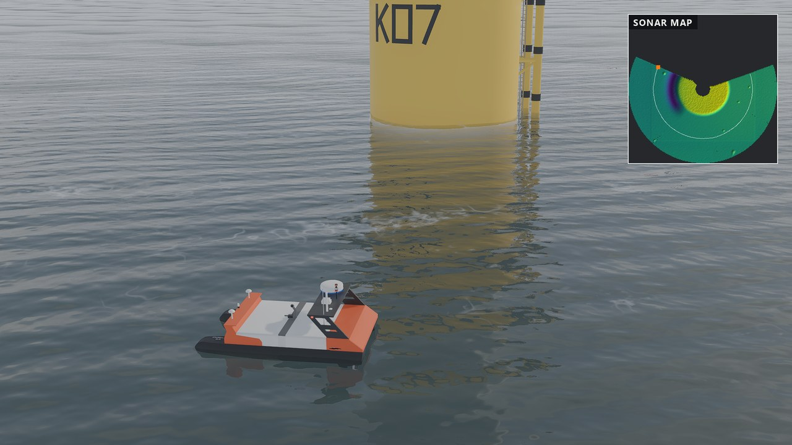<br><em>Vulkan: five robots inspect an offshore wind turbine; the Otter X maps the seabed (<a href="python/examples/turbine">turbine</a>)</em></td>
<td align="center">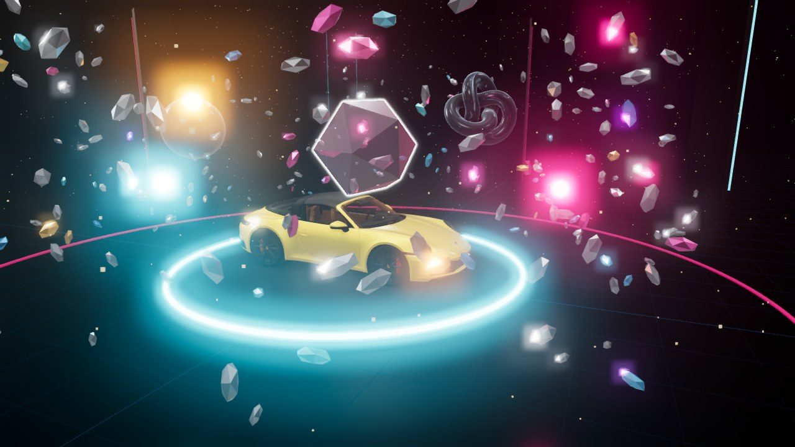<br><em>OpenGL: room lighting, glass, soft shadows, GTAO, bloom and outline in one frame (<a href="examples/misc/showpiece.cpp">showpiece</a>)</em></td>
</tr>
<tr>
<td align="center">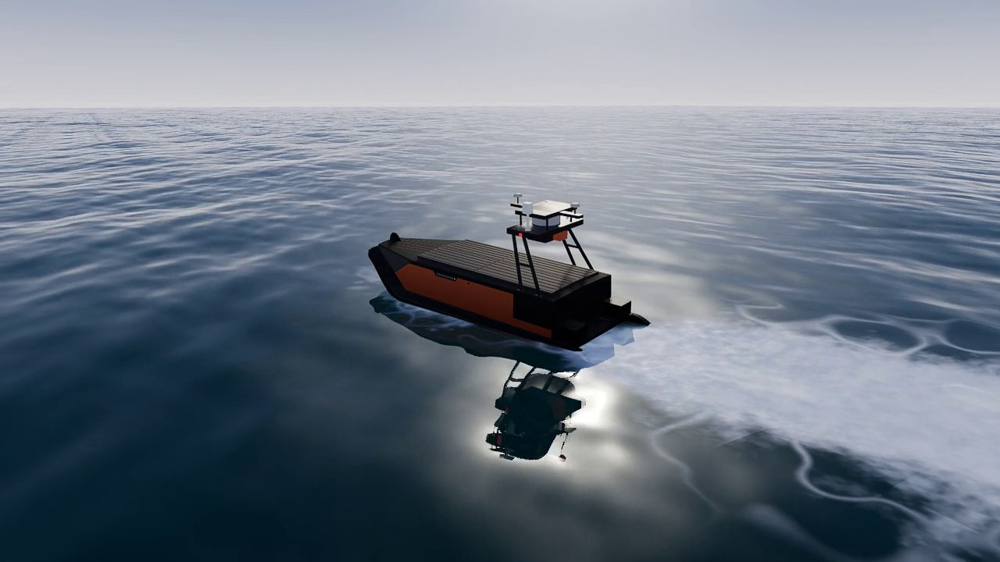<br><em>Vulkan: a sea drone under way on the FFT ocean (<a href="python/examples/usv">usv</a>)</em></td>
<td align="center">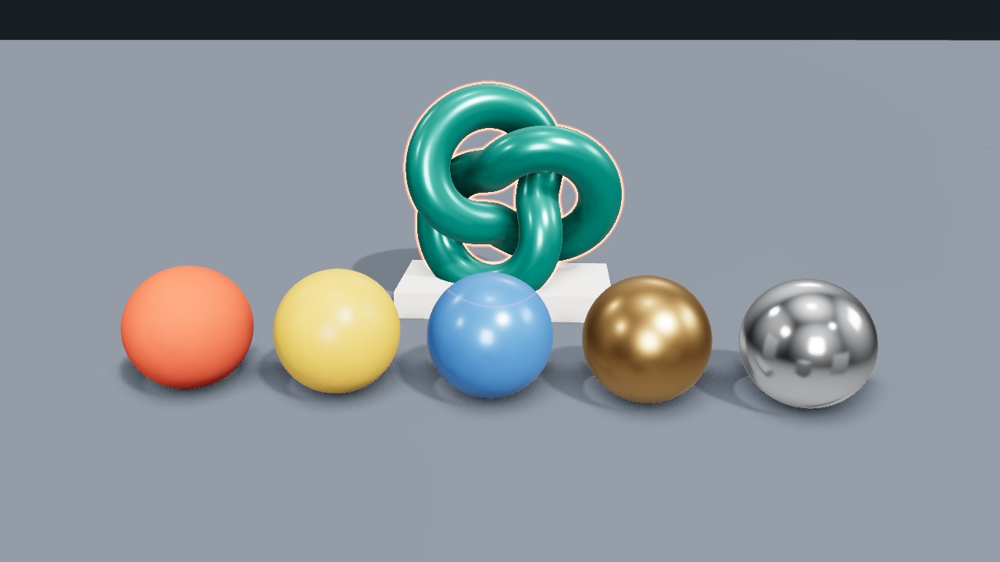<br><em>OpenGL from Python: soft shadows, ambient occlusion and a selection outline (<a href="python/examples/gl_studio.py">gl_studio.py</a>)</em></td>
</tr>
<tr>
<td align="center">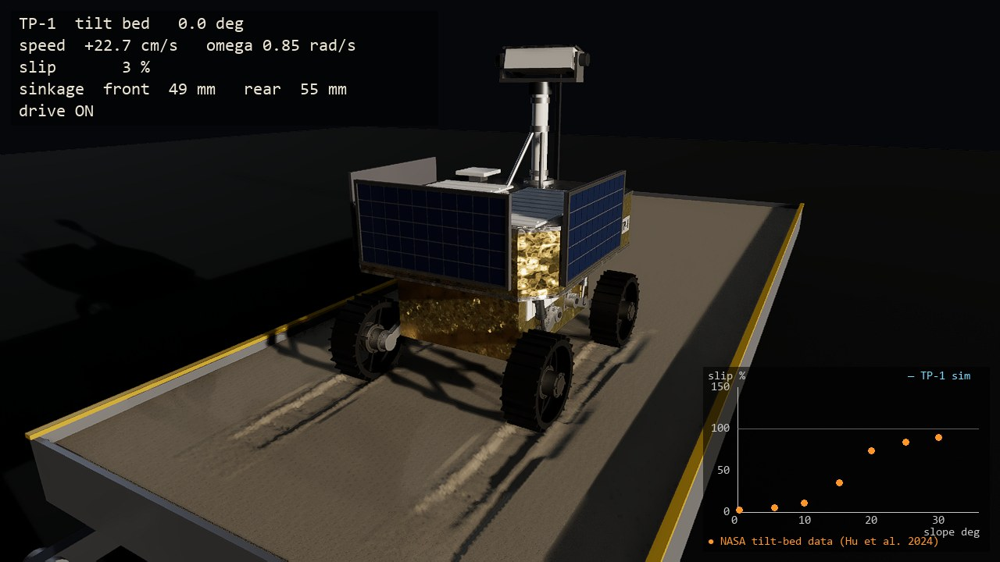<br><em>Vulkan and Warp: a rover climbs loose sand in GPU grains, with slip plotted against tilt-bed data (<a href="python/examples/rover">rover</a>)</em></td>
<td align="center">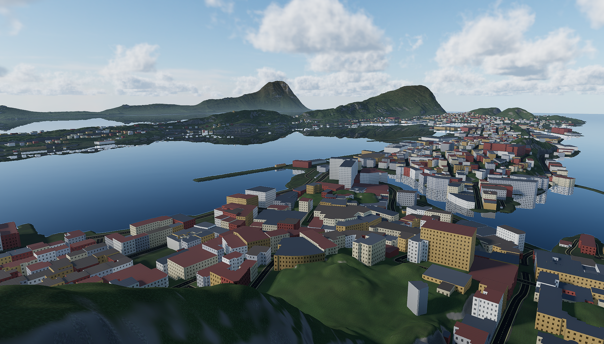<br><em>Vulkan: Ålesund from Kartverket elevation, NVDB roads and OSM footprints (<a href="examples/extras/terrain/norway_terrain.cpp">norway_terrain</a>)</em></td>
</tr>
<tr>
<td align="center">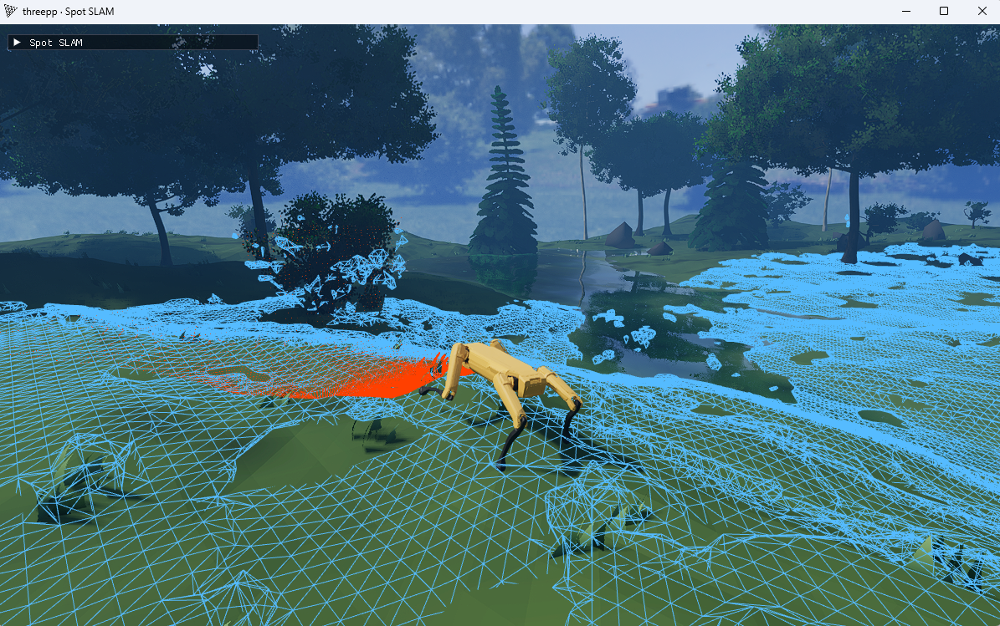<br><em>Vulkan: an RL-trained Spot walks a procedural forest while its depth camera builds a live SLAM surface (<a href="python/examples/spot/spot_slam.py">spot_slam.py</a>)</em></td>
<td align="center">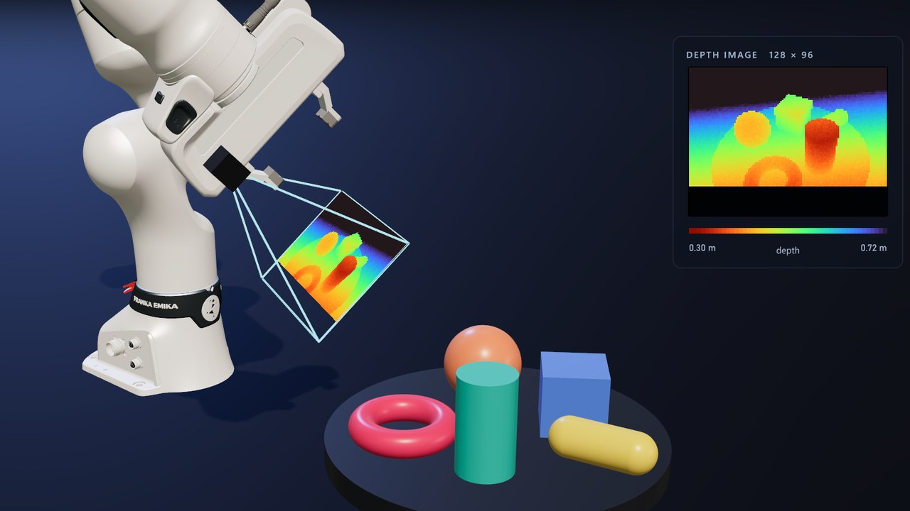<br><em>OpenGL: a depth camera on a Franka FR3, placed by IK, scans a tray (lesson part 2, <a href="https://github.com/markaren/threepp-lessons/blob/main/films/depth_map.py">depth_map.py</a>)</em></td>
</tr>
<tr>
<td align="center">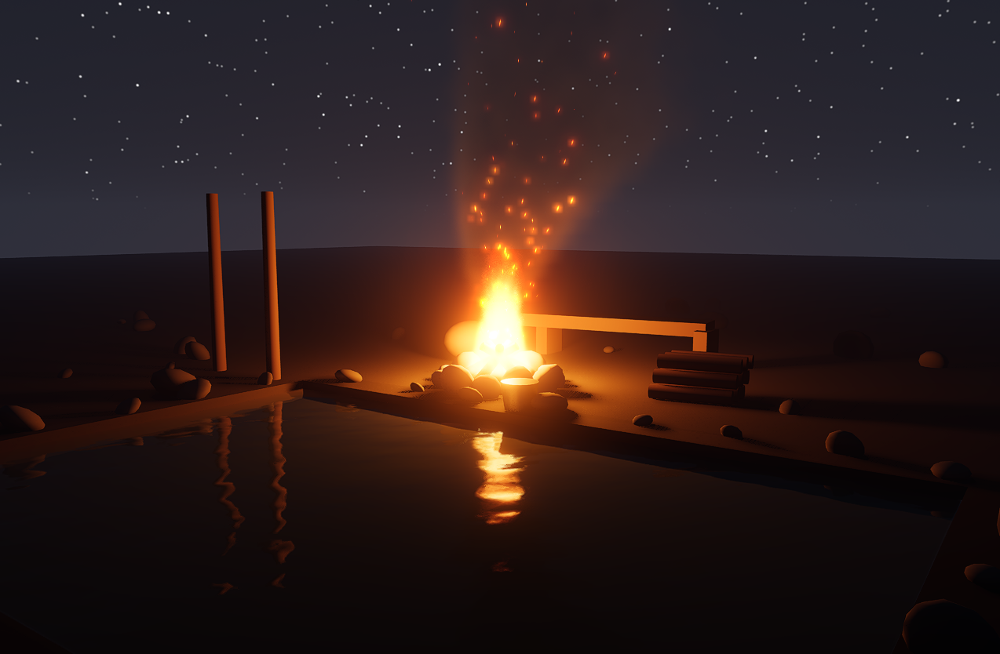<br><em>Vulkan: a campfire <code>ParticleField</code>, marched as participating media (<a href="examples/vulkan/vulkan_fire.cpp">vulkan_fire</a>)</em></td>
<td align="center">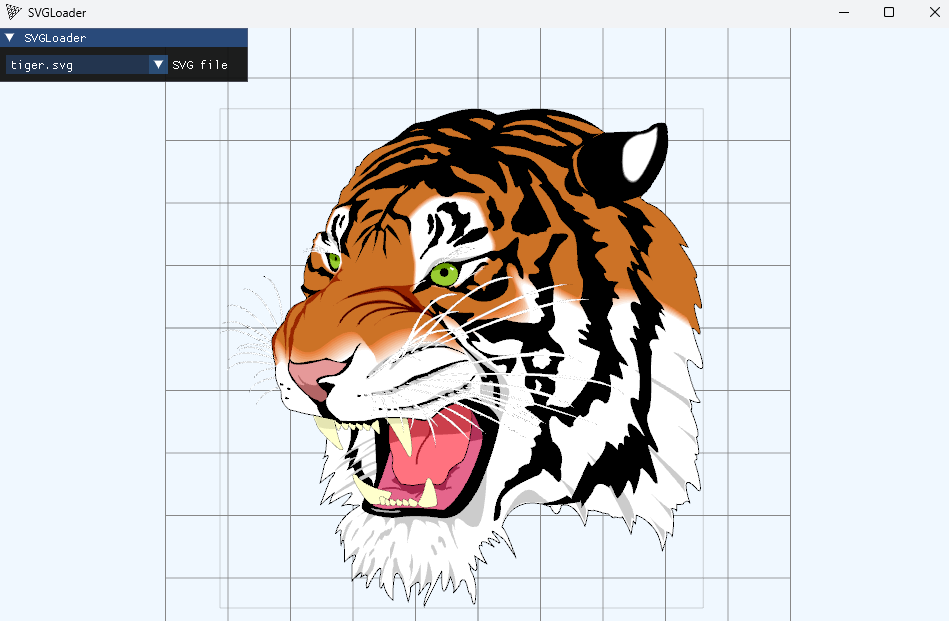<br><em>OpenGL and Vulkan: the SVG loader (<a href="examples/loaders/svg_loader.cpp">svg_loader</a>)</em></td>
</tr>
</table>

## License

threepp is [MIT-licensed](LICENSE). It ports the API and shaders of
[three.js](https://github.com/mrdoob/three.js) (MIT) and bundles or fetches a number of third-party
libraries and assets; see [THIRD_PARTY.md](THIRD_PARTY.md) for the full index, including the parts
that are *not* MIT (the optional NVIDIA DLSS SDK, and the Boston Dynamics Spot model in `threepp_data`).
