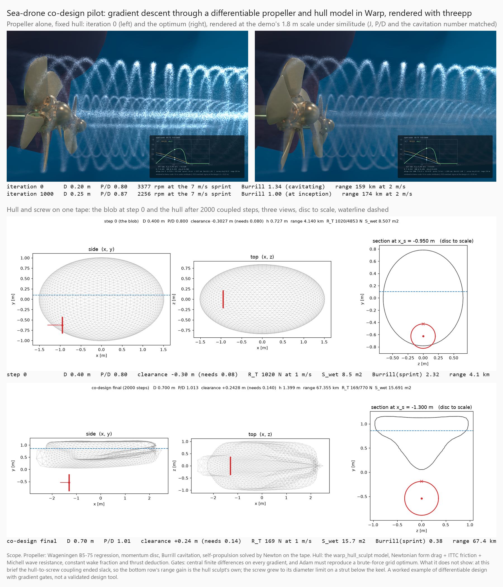

# drone_codesign: a differentiable propeller and hull on one Warp tape

A worked example of gradient-based design through differentiable physics, with the gradients
checked rather than trusted. The propeller half is the Wageningen B5-75 open-water regression,
the actuator-disc momentum balance and Burrill's cavitation criterion, all ported from
`warp_prop_vortex.py` into Warp kernels, plus a self-propulsion solve (Newton, unrolled on the
tape) so that a design's rpm is whatever makes thrust meet the hull's resistance. The objective
is range at survey speed on a fixed battery, with cavitation at sprint, motor rpm, tip clearance
and immersion as squared hinges. The hull half is `warp_hull_sculpt.py`'s model (Newtonian form
drag, ITTC friction, Michell wave resistance, hydrostatics and a roll rollout), joined to the
screw through the resistance at two speeds, the draft plane and a differentiable clearance
constraint.

What it does not claim: the fluid model is a regression and a pressure law, the wake fraction
and thrust deduction are constants, and at the brief in the figure the hull-to-screw coupling
ended slack, so the co-design's range gain is the hull sculpt's own. It is not a validated
design tool. What it does show: the whole chain differentiates correctly (finite differences on
every gradient, Adam reproducing a brute-force grid optimum), and the hull sculpt's own fairness
gradient was wrong until this work found it (a Warp loop-accumulator adjoint, see the kernel
comment in `warp_hull_sculpt.py`).

## Run

    python python/examples/drone_codesign/optimize.py --selftest      # propeller pilot, ~1 min
    python python/examples/drone_codesign/codesign.py --selftest --shots python/examples/drone_codesign/out/shots
    python python/examples/warp_prop_vortex.py --shot 4 --design python/examples/drone_codesign/out/design_final.json --design-op sprint
    python python/examples/drone_codesign/figure.py                  # the png above

`prop.py` is the chain, `optimize.py` the pilot (tables, FD, grid, Adam), `codesign.py` the
coupled run and its five gates, `figure.py` the tiling. `--design` in the prop demo renders any
design JSON at the demo's 1.8 m scale under similitude: with the advance ratio, pitch ratio,
speed of advance and static head matched, the thrust and torque coefficients, efficiency,
cavitation number and disc loading are the design's own.
