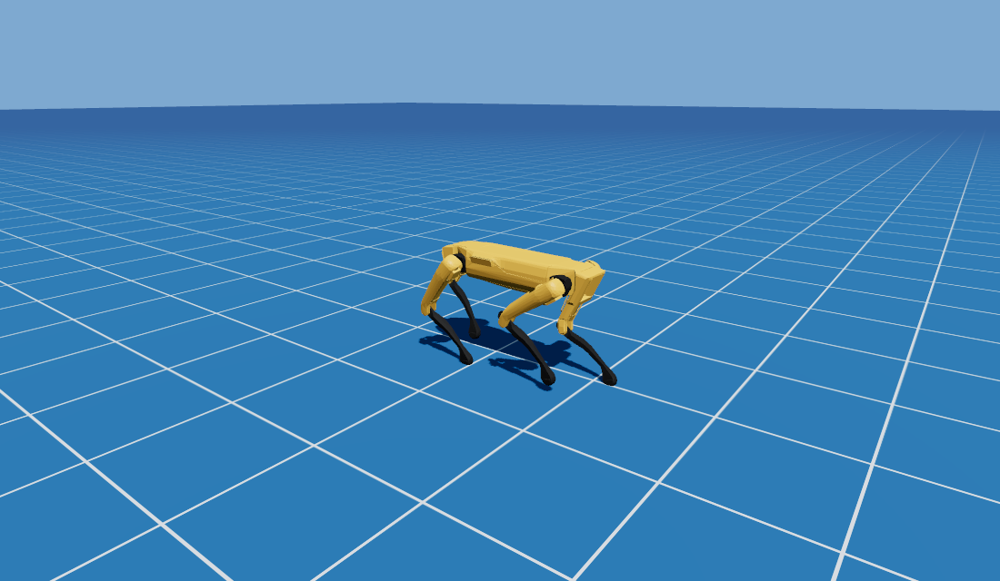

# Spot — terrain locomotion RL on GpuSim



Reinforcement-learning locomotion for the Boston Dynamics Spot, trained **entirely inside threepp** on
the batched direct-GPU PhysX backend (`threepp.rl.GpuSim`) with a compact owned PPO (`threepp.rl.PPO`),
and deployed + rendered with threepp's own GL renderer. One engine for physics, training, and rendering.

The headline result is **`spot_steps.pt` — a single generalist policy** that walks flat ground, negotiates
rough/uneven terrain, and climbs discrete stairs up to **0.20 m risers**, while preserving the original
velocity/steering command-following and a symmetric (drift-free) gait.

## How it works

Everything starts from the **Isaac Lab Spot velocity walker** (a TorchScript actor, 48-d proprioceptive
obs → 12 joint targets) — see `spot_deploy.py`, which loads and runs it on a single CPU Spot. We
**warm-start** that walker into a wider network whose observation also carries a **terrain height scan**
(the 10 new input columns zero-init, so the policy *begins* bit-identical to the flat walker) and
PPO-fine-tune the whole gait on terrain. The objective is **velocity-command tracking** (exp-kernel on the
commanded body-frame `[vx, vy, wz]`), plus a **scan-gated imitation anchor** that keeps the gait matched to
the teacher on locally-flat ground so steering is never forgotten.

```
obs (94): lin_b(3) ang_b(3) proj_g(3) cmd(3) qpos(12) qvel(12) last_act(12) base_above(1) scan(45)
action (12): joint targets = default_q + ACTION_SCALE * a   (Isaac order, unclamped)
```

The terrain `scan` is a **2-D heading-relative height grid** (45 = 9 forward x 5 lateral, ~1.1 m look-ahead),
the same idea as IsaacLab's height scanner. In training it is the exact analytic terrain height (privileged).
At deploy the viewers replace it with **onboard perception** — see "Seeing the terrain" below.

`spot_steps.pt` is the end of a **cumulative warm-start chain** — Isaac walker → heightfield (smooth
rough) → stairs — where each stage keeps the previous skills because every env shares the exact same
obs/action/reward contract.

## Terrain stages (each: env + trainer + viewer)

| Terrain | env | what it adds |
|---|---|---|
| **tents** (debut) | `spot_terrain_env.py` | velocity-tracking + randomized commands on the original stair-tent terrain |
| **rough** (box humps) | `spot_rough_env.py` | gentle uneven ground from smooth box-built noise |
| **heightfield** | `spot_heightfield_env.py` | true continuous 2-D rough terrain (triangle-soup → `add_static_trimesh`), smooth at high amplitude |
| **stairs** | `spot_steps_env.py` | discrete risers + an **adaptive per-env difficulty curriculum** (promote on clearing a tent, demote on falling) |

Shared pieces: `spot_symmetry.py` (left-right mirror + symmetry-augmentation loss, kills the lateral
gait drift), and `spot_deploy.py` (the Isaac-walker deploy + the asset/robot construction layer everything
imports). The viewers are CPU-deploy + GL render with hot-reload, keyboard steering, and a chase cam.

## Seeing the terrain (onboard perception in the viewers)

In training the height scan is privileged (exact terrain), but no real robot has that. Every `play_*`
viewer instead feeds the policy a scan derived from **onboard perception**, via `spot_depth_scan.py`:

- A `threepp.DepthSensor` is mounted on the body looking **forward and down** (~40°), like Spot's real
  depth cameras. Each control tick it renders the scene from that viewpoint and reprojects to a
  world-space point cloud (the robot is hidden during the scan = perfect self-filtering).
- The cloud is fused into an accumulating **2.5-D elevation map**; cells now beside/under/behind the
  robot were *ahead* of it a moment ago, so they are remembered (a forward camera alone can't see them).
- The 45-cell heading-relative grid is sampled from the map — a drop-in for the analytic scan.

The viewers draw the raw point cloud and the policy's scan grid, and expose a range-noise slider.
Pass `--analytic` to fall back to the privileged oracle for an A/B; `--noise M` sets sensor range noise.
The deployed gait is essentially unchanged from the oracle, and survives several cm of range noise.

## Run it

```bash
# selftest any env (finiteness + a stable stand)
K=64 python spot_steps_env.py

# watch the generalist drive (hot-reloads spot_steps.pt; arrows/numpad steer, R resets)
python play_spot_steps.py --level 3     # spawn at the 0.13 m riser band
python play_spot_heightfield.py         # same policy on continuous rough terrain
python play_spot_rough.py               # ...and on box humps

# train (warm-starts from the previous stage; curriculum auto-ramps)
python train_spot_steps.py --iters 1000            # stairs, from spot_hf.pt, symmetry on
python train_spot_heightfield.py --iters 250       # heightfield, from the Isaac walker
python train_spot_steps.py --score spot_steps.pt   # deterministic track / fell / riser level reached
python train_spot_steps.py --eval  spot_steps.pt   # held-out per-command steering regression vs the teacher
```

Checkpoints (`*.pt`) are git-ignored — regenerate by training, or keep your own locally.

## Notes / design choices

- **GpuSim is the enabler** — K Spots in one direct-GPU PhysX scene; the 48-d Isaac obs is assembled as
  torch ops on the GPU state. ~35–40k env-steps/s at K=2048 on an RTX 4070.
- **Privileged terrain scan in training, perception at deploy** — training uses the exact analytic
  45-cell height grid (privileged, like IsaacLab's height scanner); the viewers estimate that same grid
  from an onboard depth camera + elevation map (see "Seeing the terrain"). One obs contract, two sources.
- **Drop-settle spawns** — the robot is placed referenced to the highest terrain under its footprint so a
  foot never spawns inside the terrain (no depenetration jolt).
- **CPU deploy / sim-to-sim** — viewers default to `tgs_pcm`/0.005 to match the GpuSim training contact
  model; `--pgs` selects PhysX's default solver. Both transfer for this gait.
- **Steering preservation** — best checkpoints are gated on a held-out flat-steering eval, not training
  reward; `--score`/`--eval` are the real acceptance tests.

The PPO has a general `aux_loss` hook (used here for symmetry augmentation; also reusable for a
behavioral-cloning / KL anchor to the teacher).
