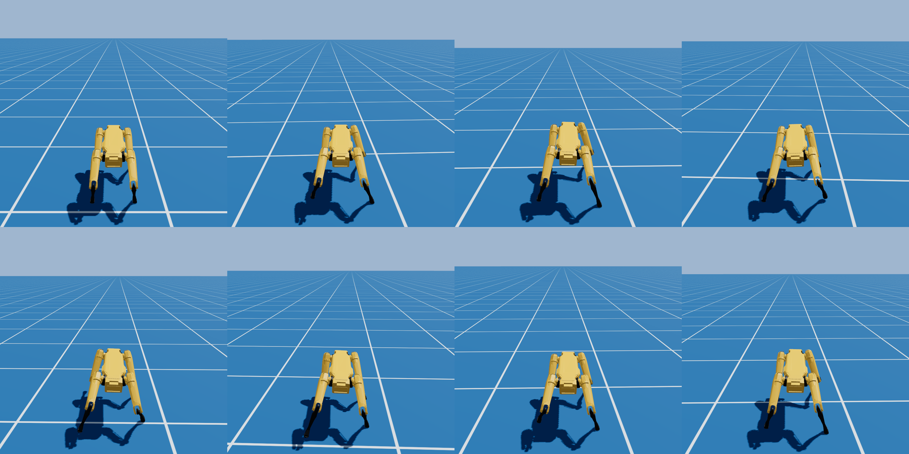

# Spot — deploying an Isaac Lab policy in threepp

[`spot_deploy.py`](spot_deploy.py) takes a **Boston Dynamics Spot URDF** and a
**locomotion policy trained in Isaac Lab**, and makes Spot walk in threepp's
PhysX — a sim-to-sim transfer with **no retraining**. Drive it with the **arrow
keys / numpad**; the camera follows.

| | | |
| --- | --- | --- |
| **forward** UP / NUM 8 | **back** DOWN / NUM 2 | **turn L** N / NUM 7 |
| **strafe L** LEFT / NUM 4 | **strafe R** RIGHT / NUM 6 | **turn R** M / NUM 9 |


```sh
python spot_deploy.py                  # interactive — assets download on first run
python spot_deploy.py --shot out.png
```

On first run the assets download once to `~/.cache/threepp/spot` (re-runs reuse
them); pass `--assets <folder>` to use your own copy instead. They come from
Isaac Sim + the Spot SDK:

| file | source |
| --- | --- |
| `spot_policy.pt` | Isaac Lab **Spot velocity** policy (TorchScript) — *the only file the demo needs* |
| `spot_env.yaml` | the Isaac env config (the obs/action contract; baked into the script) |
| `model.urdf` + `link_models/` | Boston Dynamics Spot SDK URDF (cached for the URDF importer) |

Needs a **PhysX-enabled** threepp build (`tp.HAS_PHYSX`) and **torch**.

## How it works

The whole trick is reproducing Isaac Lab's observation/action contract exactly,
then letting PhysX do the rest:

- **Observation (48-d, this order):** base linear velocity, base angular velocity,
  projected gravity (all body-frame), the velocity command `[vx, vy, wz]`,
  joint positions relative to the default pose, joint velocities, and the last
  action — in Isaac's joint order (`hx`×4, `hy`×4, `kn`×4).
- **Action:** `target_q = default_pose + 0.2 · action`, applied as PD position
  targets (stiffness 60, damping 1.5; effort 45 hips / 115 knees).
- **Physics:** Spot is a reduced-coordinate `Articulation` stepped at 0.002 s with
  decimation 10 (50 Hz policy), in a **Z-up** world to match the URDF.

## Sim-to-sim caveats (why it transfers anyway)

threepp and Isaac Lab **both run PhysX 5**, which is what makes this work despite
the approximations:

- The URDF carries **no inertials or collision**, so link masses are approximated
  and each link gets a **Box/Capsule** collider for the physics (the articulation
  API takes primitive shapes). Those primitives are hidden — each link's **visual
  mesh** (`link_models/*.obj`) is parented under its collider, so Spot *renders* as
  the real robot while the capsules drive the simulation.
- The knee's **remotized** actuator is treated as a plain PD.

With the obs/action contract exact, the policy still produces a clean forward trot
at ~0.9 m/s for a 1.0 m/s command. Tune `MASS` / `GAINS` / `Z0` at the top of the
script for other robots or policies.

---

# Training Spot to walk from scratch (RL, no Isaac policy)

The rest of this folder trains Spot's gait **from scratch** in threepp — author the
robot in Python, train thousands of them on threepp's **GPU** PhysX, then deploy +
render. It runs the standard SOTA legged-RL recipe: a **gait-phase clock** with a
diagonal-trot **contact-schedule reward**, which *prescribes* the trot (penalty-only
rewards just produce a shuffle).

```sh
python train_spot_walk.py --iters 1500    # train on GpuSim (~4096 robots, ~70k steps/s)
python play_spot_walk.py                  # deploy on the CPU world + render (chase cam)
python play_spot_walk.py --shot 8         # headless montage -> spot_walk_shot.png
```



| file | role |
| --- | --- |
| [`spot_gpu.py`](spot_gpu.py) | shared GpuSim infra — `SpotGpu` build factory, `flat_ground`, `quat_rotate_inverse` |
| [`spot_walk_env.py`](spot_walk_env.py) | the GpuSim RL env — gait-phase trot reward, heading-hold, per-env friction DR |
| [`train_spot_walk.py`](train_spot_walk.py) | PPO trainer (`threepp.rl.PPO`) |
| [`play_spot_walk.py`](play_spot_walk.py) | CPU-world deploy + GL render (runs the gait-phase clock + heading-hold) |
| [`spot_cpu_env.py`](spot_cpu_env.py) / [`train_spot_cpu.py`](train_spot_cpu.py) | train **directly on the CPU** articulation — no sim-to-sim gap (`train == deploy`) |

Key findings (the hard-won ones): the soft Isaac PD (stiffness 60) is too compliant
for our ~28 kg model — the legs sag and nothing can step, so the from-scratch gait
uses **stiffness 120**. Grippy **restitution-0 feet** (via `world.create_material(...)`,
the new material API) + per-env friction randomization make push-off clean and the
gait robust. `PhysxWorld(tgs_pcm=True)` makes the CPU deploy use the same TGS+PCM
contact model as the GPU training.
