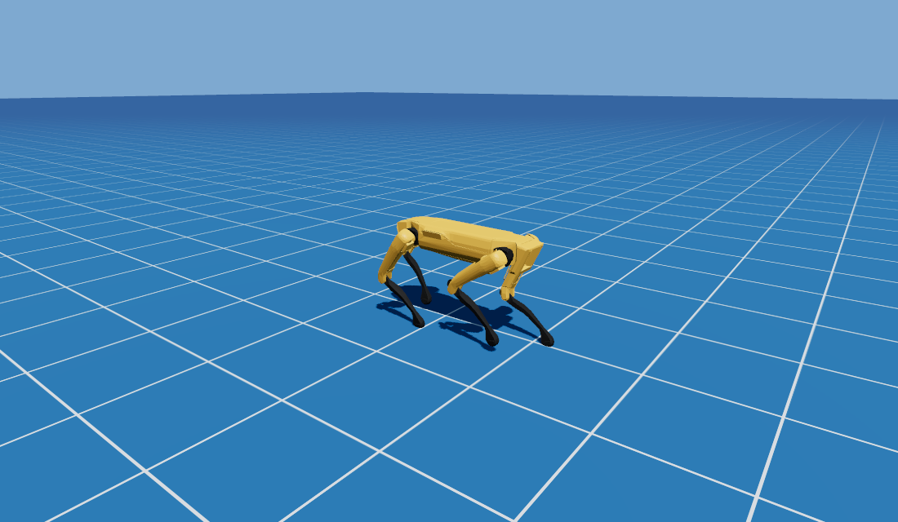

# Spot — terrain locomotion RL on GpuSim



Reinforcement-learning locomotion for the Boston Dynamics Spot, trained **entirely inside threepp** on
the batched direct-GPU PhysX backend (`threepp.rl.GpuSim`) with a compact owned PPO (`threepp.rl.PPO`),
and deployed + rendered with threepp's own GL renderer. One engine for physics, training, and rendering.

The headline result is **`spot_steps.pt` — a single generalist policy** that walks flat ground, negotiates
rough/uneven terrain, and climbs discrete stairs up to **0.20 m risers**, while preserving the base gait's
velocity/steering command-following and a symmetric (drift-free) gait.

## How it works

Locomotion is built in two stages, both trained from scratch inside threepp:

**1. A clean-lineage base gait (`scratch_distillation/`).** The Isaac Lab Spot velocity walker (a
TorchScript actor, 48-d proprioceptive obs → 12 joint targets) is used **only as a reward oracle** — an
imitation penalty during training; its weights never enter the student. `train_scratch.py` trains an actor
**from random init** into `scratch_flat_best.pt`: a flat-ground velocity walker with a **trot phase clock**
(the obs carries `[sin(2π·phi), cos(2π·phi)]` so the policy self-phase-locks a gait), `normalize_obs=True`,
and **stiff PD gains (90)**. Obs is 50-d = 48 proprio + 2 clock. Because no Isaac-derived weights survive,
the deployed network is clean-lineage.

**2. Terrain fine-tune.** Each terrain env **warm-starts** that base gait into a wider network whose
observation also carries a **terrain height scan**. The 50 proprio+clock input columns are copied verbatim
and the 46 new terrain columns (`base_above` + `scan`) zero-init, so the policy *begins* bit-identical to
the flat clock walker. PPO then fine-tunes the whole gait on terrain. The objective is **velocity-command
tracking** (exp-kernel on the commanded body-frame `[vx, vy, wz]`), plus a **scan-gated imitation anchor**
that keeps the gait matched to the base walker on locally-flat ground so steering is never forgotten.

```
obs (96): lin_b(3) ang_b(3) proj_g(3) cmd(3) qpos(12) qvel(12) last_act(12) | clock(2) | base_above(1) | scan(45)
          \_______________________ proprio (48) ______________________/
action (12): joint targets = default_q + ACTION_SCALE * a   (Isaac order, unclamped)
```

The terrain `scan` is a **2-D heading-relative height grid** (45 = 9 forward x 5 lateral, ~1.1 m look-ahead),
the same idea as IsaacLab's height scanner. In training it is the exact analytic terrain height (privileged).
At deploy the viewers replace it with **onboard perception** — see "Seeing the terrain" below.

The three terrain envs are **parallel fine-tunes of the same base gait**, not a cumulative chain — each
warm-starts independently from `scratch_flat_best.pt` and they all share the exact same 96-d obs / action /
reward contract, so any checkpoint transfers across all of them. `spot_steps.pt` (trained on the hardest
terrain, discrete stairs) is the generalist the viewers default to.

## Stages (each terrain: env + trainer + viewer)

| Stage | env | trainer / viewer | what it adds |
|---|---|---|---|
| **base gait** | `scratch_distillation/` (`scratch_env.py` + `scratch_clock.py`) | `train_scratch.py` / `spot_deploy.py` | from-scratch clock walker on flat ground; Isaac teacher = reward oracle only |
| **tents** | `spot_terrain_env.py` (`SpotTerrainEnv`) | `train_spot_stairs.py` / `play_spot_stairs.py` | velocity-tracking on graded up/down stair-tent terrain (`spot_terrain.pt`) |
| **heightfield** | `spot_heightfield_env.py` | `train_spot_heightfield.py` / `play_spot_heightfield.py` | true continuous 2-D rough terrain (triangle-soup → `add_static_trimesh`), smooth at high amplitude (`spot_hf.pt`) |
| **stairs** | `spot_steps_env.py` (`SpotStepsEnv`) | `train_spot_steps.py` / `play_spot_steps.py` | discrete risers (0.04→0.20 m) + an **adaptive per-env difficulty curriculum** (promote on clearing a tent, demote on falling) — yields `spot_steps.pt` |

`spot_terrain_env.py` is also the shared module: it defines the sim constants, the 2-D scan grid, and the
reward/reset helpers the other terrain envs import.

Shared pieces: `spot_symmetry.py` / `spot_steps_symmetry.py` (left-right mirror + symmetry-augmentation
loss, kills the lateral gait drift), and `spot_deploy.py` (deploys the base clock gait + the asset/robot
construction layer everything imports). The viewers are CPU-deploy + GL render with hot-reload, keyboard
steering, and a chase cam. `spot_slam.py` is a bonus demo — Spot walks procedural terrain while a
body-mounted depth camera reconstructs a live marching-cubes SLAM surface over the ground truth.

## Seeing the terrain (onboard perception in the viewers)

In training the height scan is privileged (exact terrain), but no real robot has that. Every `play_*`
viewer instead feeds the policy a scan derived from **onboard perception**, via `spot_depth_scan.py`:

- A `threepp.DepthSensor` is mounted on the body looking **forward and down** (~40°), like Spot's real
  depth cameras. Each control tick it renders the scene from that viewpoint and reprojects to a
  world-space point cloud (the robot is hidden during the scan = perfect self-filtering).
- The cloud is fused into an accumulating **2.5-D elevation map**; cells now beside/under/behind the
  robot were *ahead* of it a moment ago, so they are remembered (a forward camera alone can't see them).
- The 45-cell heading-relative grid is sampled from the map — a drop-in for the analytic scan.

The viewers draw the raw point cloud and the policy's scan grid, and expose a range-noise slider.
Pass `--analytic` to fall back to the privileged oracle for an A/B; `--noise M` sets sensor range noise.
The deployed gait is essentially unchanged from the oracle, and survives several cm of range noise.

## Run it

```bash
# 0. base gait — a from-scratch clock walker on flat ground (the Isaac walker is only a reward oracle)
python scratch_distillation/train_scratch.py --envs 4096 --iters 4000   # -> scratch_flat_best.pt (50-d, stiff gains 90)
python spot_deploy.py                                                    # drive that base gait on flat ground

# selftest any terrain env (finiteness + a stable stand); HEIGHT_SOURCE=raycast for the BVH scan
K=64 python spot_steps_env.py
K=64 HEIGHT_SOURCE=raycast python spot_steps_env.py
python spot_scan_ab.py --env steps --envs 2048       # A/B the two height sources (see below)

# watch the generalist drive (hot-reloads spot_steps.pt; arrows/numpad steer, R resets)
python play_spot_steps.py --level 3     # spawn at the 0.13 m riser band
python play_spot_heightfield.py         # same policy on continuous rough terrain
python play_spot_stairs.py              # ...and on the graded tent terrain

# train each terrain fine-tune (all warm-start from scratch_flat_best.pt; identical 96-d contract)
python train_spot_steps.py --iters 1500            # stairs + adaptive curriculum, symmetry on
python train_spot_heightfield.py --iters 250       # continuous heightfield
python train_spot_stairs.py --iters 1500           # graded tent terrain
python train_spot_steps.py --score spot_steps.pt   # deterministic track / fell / riser level reached
python train_spot_steps.py --eval  spot_steps.pt   # held-out per-command steering regression vs the base gait
```

Checkpoints (`*.pt`) are git-ignored — regenerate by training, or keep your own locally.

## Notes / design choices

- **Clean lineage** — the deployed network is trained from random init; the Isaac walker is only an
  imitation reward oracle, so no Isaac-licensed weights enter the shipped policy.
- **GpuSim is the enabler** — K Spots in one direct-GPU PhysX scene; the 48-d Isaac obs is assembled as
  torch ops on the GPU state. ~35–40k env-steps/s at K=2048 on an RTX 4070.
- **`--graph` makes it ~1.26× faster** — the step is launch-bound, not compute-bound: 584 torch ops
  whose dispatch costs more than their execution, and that cost is flat in K (12 ms at K=1024 and at
  K=2048, against 13.6 ms of physics). `VecTask(graph=True)` replays the whole torch region from a
  CUDA graph: `env.step` 22.54 → 13.20 ms, training 41.8k → 52.6k steps/s. Verified against a
  recomputed observation before training starts (0.0 exactly on the privileged scan). Off by default.
- **Privileged terrain scan in training, perception at deploy** — training uses the exact analytic
  45-cell height grid (privileged, like IsaacLab's height scanner); the viewers estimate that same grid
  from an onboard depth camera + elevation map (see "Seeing the terrain"). One obs contract, two sources.
- **Or read the terrain by raycast** — `SpotStepsEnv(..., height_source="raycast")` and the same on
  `SpotHeightfieldEnv` answer the height query with a ray into a Warp BVH over the geometry the world
  was actually built from (`threepp.rl.raycast`), instead of the closed-form formula. It is one kernel
  where the formula is thirty torch ops, so it is **8x faster** and takes the whole `env.step` from
  42.0 to 38.3 ms at K=2048. Off by default: it changes the observation slightly (see below), and no
  shipped checkpoint was trained on it.
- **Drop-settle spawns** — the robot is placed referenced to the highest terrain under its footprint so a
  foot never spawns inside the terrain (no depenetration jolt).
- **CPU deploy / sim-to-sim** — viewers default to `tgs_pcm`/0.005 to match the GpuSim training contact
  model; `--pgs` selects PhysX's default solver. Both transfer for this gait.
- **Steering preservation** — best checkpoints are gated on a held-out flat-steering eval (vs the base
  gait), not training reward; `--score`/`--eval` are the real acceptance tests.

The PPO has a general `aux_loss` hook (used here for symmetry augmentation; also reusable for a
behavioral-cloning / KL anchor to the teacher).

## What the raycast scan says about the analytic one

`spot_scan_ab.py` runs both height sources through the env's own `_terrain_h` and compares them.
Where the formula is exact the raycast reproduces it exactly; where they part, the formula is the
one that is wrong, because the raycast reads the collider.

```bash
python spot_scan_ab.py --env steps --envs 2048        # agreement + interleaved cost
python spot_scan_ab.py --env heightfield --envs 1024
```

**Stairs, K=2048** — 436 730 probes inside a lane: **max 0.000000 m, mean 4.3e-8, zero over 1 mm.**
The tent formula and the boxes are the same surface. Two places they differ:

- *Past the lane edge.* The tent boxes are a **full lane wide and tile with no gap**, so at
  `|dy| > HALF_W_STEPS` the neighbour's tread is really there — up to 0.60 m of it. The formula
  gates every query to the robot's own lane and reports flat ground. Over 150 steps of driving
  `spot_steps.pt`, 1.3% of the 13.8 M observed scan cells reach out there, and the policy is told
  the ground is level exactly when it is drifting toward a staircase it could trip on.
- *Tread seams.* Adjacent tread boxes share a face; a ray at the seam takes the upper box and the
  formula's `floor()` takes the lower. The window is **under a micrometre wide** — 4 cells in 13.8 M
  — and the disagreement is exactly one riser.

**Heightfield, K=1024** — the formula is `amp * bilinear(grid)` but the collider is the
*triangulation* of that same grid. Two different surfaces: inside the lane they differ by up to
**9.8 mm** (mean 0.25 mm), on 7% of probes, against a terrain amplitude of 0.18 m. The feet stand on
the triangles.

Neither of these makes the shipped policy wrong — it was trained against the analytic obs and is
consistent with it. They are the reason the raycast is the better source to train the *next* one on,
and the reason the scan no longer has to be a formula at all.

**Does the difference cost anything?** `--score-source` scores a checkpoint against the *other*
oracle, which is the mismatch experiment. `spot_steps.pt`, trained entirely on the analytic scan:

```bash
python train_spot_steps.py --score spot_steps.pt --score-source analytic   # track 1.892  fell 0.0000  level 0.93
python train_spot_steps.py --score spot_steps.pt --score-source raycast    # track 1.886  fell 0.0000  level 0.95
```

−0.3% tracking, no extra falls, the same curriculum level. So the swap is safe on an existing
policy — you get the faster scan and the formula-free terrain without invalidating the checkpoint.
Both trainers take `--height-source raycast`, and the choice is written into the checkpoint meta so
`--score` / `--eval` rebuild the env the way it was trained.

## Training on the scan the camera could actually have seen

The scan above is still **privileged**: the exact height at all 45 cells, which no robot has. The
`play_*` viewers already replace it with an onboard depth camera and an elevation map
("Seeing the terrain"), but training never saw that. `--perceive` puts the same camera inside the
training loop (`threepp.rl.perception`): each control step it casts one ray from the body-mounted
camera to every query point, marks what was actually visible into a per-env world-anchored map, and
answers the scan from the map — so a cell reads as terrain once it has been observed and as flat
ground until then. Same mount, FOV, range and fallback as `spot_depth_scan.ForwardDepthScanner`, so
the training camera and the deploy camera are one camera. **Reward, termination and the drop-settle
spawn keep reading ground truth** — the policy is handicapped, the training signal is not.

```bash
python spot_occlusion.py --envs 512               # what the camera can and cannot see
python spot_occlusion.py --noise 0.05             # + 5 cm of elevation-map error
python train_spot_steps.py --perceive --iters 1500
python train_spot_steps.py --score spot_steps.pt --score-perceive on    # the mismatch experiment
```

**What the camera sees** (512 envs x 250 steps driving `spot_steps.pt`, levels spread over all six
riser bands): **49.8% of scan cells directly visible, 41.9% answered from memory, 11.9% blind.**
That average hides the structure, which is the interesting part — by forward offset:

| cell | −0.35 | −0.15 | +0.05 | +0.20 | +0.35 | +0.50 | +0.70 | +0.90 | +1.10 |
|---|---|---|---|---|---|---|---|---|---|
| visible now | 0% | 0% | 0% | 1% | 63% | 98% | 97% | 96% | 94% |
| from memory | 74% | 77% | 85% | 91% | 35% | 2% | 3% | 4% | 6% |
| blind | 26% | 23% | 15% | 8% | 6% | 6% | 7% | 8% | 8% |

A forward camera pitched 40° down cannot see the ground under its own body at all — everything
behind +0.35 m comes out of memory or nowhere. Ahead of it, where the next footfall goes, it sees
almost everything. `h_here` is answerable on 82% of ticks; the rest reuse the last height the map
could give, exactly as the deploy scanner does.

**And it makes no measurable difference to the policy.** Same env, same spawns, the observation
switched between the two, three interleaved rounds of 400 steps:

| | tracking | fell/step |
|---|---|---|
| privileged scan | 1.8995 | 0.00001 |
| camera-limited scan | 1.8991 | 0.00000 |

100.0%, and 99.8% with 5 cm of map error added. I expected this to be the biggest fidelity gap in
the stack and it measures as none at all — because the cells that go blind are the ones behind and
under the robot, which it has already walked over, while the forward cells it actually steps on are
94–98% directly visible. That is a quantitative version of what the viewers report qualitatively,
and it is specific to this camera and this terrain: a lower mount, a narrower FOV, taller obstacles
or real overhangs would all move it, and `spot_occlusion.py` is how you would find out.
